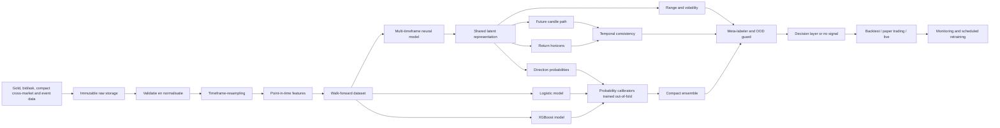
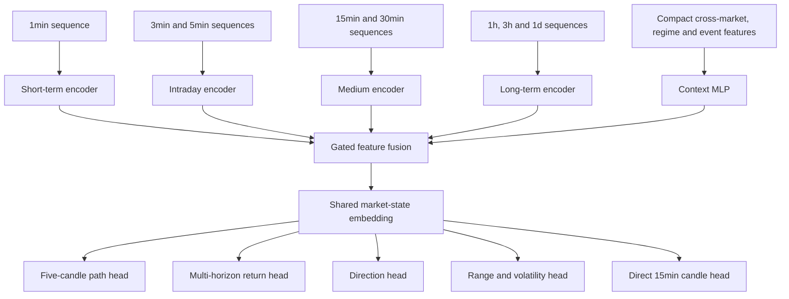

# Goudprijs-voorspellingsmodel

> Technisch ontwerp voor een probabilistisch, multi-timeframe en multi-horizon model voor goud.

## Status van dit document

Dit document beschrijft hoe het systeem ontworpen en later geïmplementeerd kan worden. Het is nog geen werkend handelsalgoritme en bevat geen bewezen rendementsclaim.

Het voorgestelde systeem voorspelt niet alleen `stijgen` of `dalen`. Het leert tegelijkertijd:

- de waarschijnlijke richting over meerdere horizons;
- een reeks toekomstige candles;
- het verwachte cumulatieve rendement;
- de vermoedelijke volatiliteit en candle-range;
- onzekerheidsintervallen rond die voorspellingen;
- of een voorspelling sterk genoeg is om na kosten als signaal te gelden;
- of verschillende modelsoorten het met elkaar eens zijn;
- of de actuele situatie voldoende lijkt op de historische trainingsdata.

De kernbeslissing is om toekomstige candles **rechtstreeks als volledige reeks** te voorspellen. De primaire modelvariant voert een voorspelde candle dus niet telkens blind terug als input voor de volgende candle. Daarmee behouden we het extra trainingssignaal van meerdere toekomstige candles zonder dat kleine fouten zich onbeperkt opstapelen.

Deze revisie voegt een beperkte set haalbare nauwkeurigheidsverbeteringen toe. De kernversie gebruikt voortaan ook een compacte cross-marketset, lichte microstructure-features, eenvoudige marktregimes en eventvensters, een ensemble van drie modelsoorten, een out-of-fold getrainde meta-labeler, recency weighting en praktische out-of-distribution-controles. Dure of moeilijk reproduceerbare uitbreidingen blijven bewust buiten de eerste versie.

---

## Inhoud

1. [Doel](#1-doel)
2. [Niet-doelen](#2-niet-doelen)
3. [Belangrijkste begrippen](#3-belangrijkste-begrippen)
4. [Gewenste uitvoer](#4-gewenste-uitvoer)
5. [Architectuur in één overzicht](#5-architectuur-in-één-overzicht)
   - [Geselecteerde realistische nauwkeurigheidsverbeteringen](#geselecteerde-realistische-nauwkeurigheidsverbeteringen)
6. [Keuze van instrument en tijdseenheden](#6-keuze-van-instrument-en-tijdseenheden)
7. [Databronnen](#7-databronnen)
8. [Dataopslag en dataschema](#8-dataopslag-en-dataschema)
9. [Datakwaliteit en point-in-time-correctheid](#9-datakwaliteit-en-point-in-time-correctheid)
10. [Timeframes construeren](#10-timeframes-construeren)
11. [Inputfeatures](#11-inputfeatures)
12. [Voorspellingsdoelen en labels](#12-voorspellingsdoelen-en-labels)
13. [Voorspellen van toekomstige candles](#13-voorspellen-van-toekomstige-candles)
14. [Modelarchitectuur](#14-modelarchitectuur)
15. [Consistentie tussen 3-minuten- en 15-minutenvoorspellingen](#15-consistentie-tussen-3-minuten--en-15-minutenvoorspellingen)
16. [Lossfuncties](#16-lossfuncties)
17. [Trainingsproces](#17-trainingsproces)
18. [Walk-forward-validatie](#18-walk-forward-validatie)
19. [Kanskalibratie](#19-kanskalibratie)
20. [Evaluatiemaatstaven](#20-evaluatiemaatstaven)
21. [Backtester](#21-backtester)
22. [Van voorspelling naar signaal](#22-van-voorspelling-naar-signaal)
23. [Paper trading en live gebruik](#23-paper-trading-en-live-gebruik)
24. [Hertraining en monitoring](#24-hertraining-en-monitoring)
25. [Vergelijkingsexperimenten](#25-vergelijkingsexperimenten)
26. [Technische stack](#26-technische-stack)
27. [Voorgestelde projectstructuur](#27-voorgestelde-projectstructuur)
28. [Voorbeeldconfiguratie](#28-voorbeeldconfiguratie)
29. [Implementatiefasen](#29-implementatiefasen)
30. [Acceptatiecriteria](#30-acceptatiecriteria)
31. [Belangrijkste risico's](#31-belangrijkste-risicos)
32. [Beslissingen vóór implementatie](#32-beslissingen-vóór-implementatie)
33. [Bronnen](#33-bronnen)

---

## 1. Doel

Het doel is een reproduceerbaar onderzoeks- en voorspellingssysteem te bouwen dat op tijdstip `t` uitsluitend informatie gebruikt die op dat moment werkelijk beschikbaar was.

Voor iedere ingestelde horizon moet het systeem onder andere kunnen leveren:

- `P(stijging)`;
- `P(daling)`;
- eventueel `P(neutraal)`;
- een verwacht rendement;
- een onzekerheidsinterval;
- een voorspelde toekomstige candlereeks;
- een signaalsterkte;
- modelovereenstemming en OOD-status;
- een beslissing `long`, `short` of `geen signaal`.

Het systeem moet meerdere timeframes als context combineren. Het kan bijvoorbeeld op basis van recente 1-, 3- en 5-minutendata, intradaydata en langetermijncontext voorspellen wat waarschijnlijk gebeurt over 3, 6, 9, 12, 15 en 30 minuten, 1 uur, 3 uur en 24 uur.

De architectuur moet modulair zijn. Dat betekent dat databronnen, features, modelvarianten, lossfuncties en backtestregels afzonderlijk vervangen en getest kunnen worden.

## 2. Niet-doelen

De eerste versie heeft uitdrukkelijk niet als doel:

- onmiddellijk echte transacties uit te voeren;
- winst te garanderen;
- nanoseconde- of high-frequency trading te ondersteunen;
- onbeperkt veel features of netwerkparameters toe te voegen;
- weights na iedere afzonderlijke foute voorspelling live bij te stellen;
- backtestresultaten als werkelijk gerealiseerde resultaten voor te stellen.

Een model kan statistisch goed voorspellen en toch na kosten verliesgevend zijn. Omgekeerd kan een model met minder dan 50% juiste richtingen winstgevend zijn wanneer winsten gemiddeld veel groter zijn dan verliezen. Voorspellingskwaliteit en handelsresultaat moeten daarom afzonderlijk worden gemeten.

## 3. Belangrijkste begrippen

### Candle

Een candle bestaat minimaal uit:

- `open`;
- `high`;
- `low`;
- `close`;
- optioneel `volume`, spread en tickactiviteit.

### Raw timeframe

De kleinste betrouwbaar opgeslagen resolutie, bij voorkeur één minuut. Alle hogere candles worden waar mogelijk deterministisch uit deze bron opgebouwd.

### Forecast timeframe

De lengte van één stap die het future-path-model voorspelt. In het centrale voorbeeld is dit drie minuten.

### Horizon

Hoe ver in de toekomst een resultaat wordt beoordeeld. Vijf voorspelde candles van drie minuten vormen een horizon van vijftien minuten.

### Context window

De historische periode die als input aan het model wordt gegeven. Iedere timeframe kan een andere lengte hebben.

### Gekalibreerde waarschijnlijkheid

Wanneer het model 70% voor `stijging` rapporteert, moet ongeveer 70% van vergelijkbare, volledig out-of-sample gevallen daadwerkelijk als stijging eindigen. Deze eigenschap wordt achteraf gemeten en gekalibreerd; een ruwe neural-network-score is nog geen betrouwbare waarschijnlijkheid.

### Point-in-time data

Data zoals die op het voorspellingstijdstip bekend was, inclusief de toenmalige versies van later herziene macro-economische cijfers.

## 4. Gewenste uitvoer

Een machineleesbaar voorspellingsrecord kan er conceptueel zo uitzien:

```json
{
  "instrument": "XAU_USD",
  "observed_until": "2026-09-03T14:00:00Z",
  "generated_at": "2026-09-03T14:00:01Z",
  "model_version": "gold-mh-v001",
  "horizon": "15min",
  "probability_up": 0.64,
  "probability_down": 0.28,
  "probability_neutral": 0.08,
  "expected_return_pct": 0.09,
  "return_p10_pct": -0.16,
  "return_p50_pct": 0.08,
  "return_p90_pct": 0.31,
  "predicted_volatility_pct": 0.22,
  "ensemble_disagreement": 0.07,
  "meta_probability_correct": 0.71,
  "distribution_status": "in_distribution",
  "signal": "weak_long",
  "signal_strength": 0.41,
  "data_quality": "valid"
}
```

Voor menselijke weergave:

```text
Instrument: XAU/USD
Horizon: 15 minuten
Richting: stijging
P(stijging): 64%
Verwacht rendement: +0,09%
80%-verwachtingsgebied: -0,16% tot +0,31%
Modelovereenstemming: goed
Marktstatus: binnen trainingsbereik
Signaal: zwak stijgend
```

De kans van 64% betekent niet automatisch 64% kans op winst. Daarvoor moeten ook spread, slippage, uitvoeringsprijs, positiegrootte en de grootte van de koersbeweging worden meegenomen.

## 5. Architectuur in één overzicht



Dezelfde featurecode wordt gebruikt voor training, backtesting en live inference. Daarmee vermijden we dat het live systeem iets anders berekent dan het trainingsproces.

## Geselecteerde realistische nauwkeurigheidsverbeteringen

Niet iedere theoretisch interessante databron hoort in de eerste implementatie. De volgende uitbreidingen worden wel onderdeel van de kernarchitectuur omdat ze relatief beheersbaar zijn, weinig gespecialiseerde infrastructuur vereisen en een duidelijke hypothese hebben die met walk-forward-tests kan worden gecontroleerd.

| Uitbreiding | Waarom haalbaar | Verwachte bijdrage | Plaats in het systeem |
|---|---|---|---|
| Lichte microstructure | Bid, ask, spread en tick count zitten vaak al in een brokerfeed | Vooral nuttig voor 3–15 minuten en voor het herkennen van slechte liquiditeit | Short-term encoder |
| Compacte cross-marketset | Slechts drie à vier extra liquide reeksen | Geeft context over dollar, rente en andere edelmetalen zonder feature-explosie | Context encoder |
| Eenvoudige regimevector | Afgeleid uit reeds beschikbare returns, volatiliteit, trend, spread en sessie | Laat het model relaties conditioneren op de actuele omstandigheden | Fusionlaag |
| Eventvensters | Een historische kalender met exacte timestamps is eenvoudiger dan volledige nieuws-NLP | Onderscheidt gewone periodes van CPI-, arbeidsmarkt- en rentebesluitvensters | Context encoder en decision policy |
| Compact ensemble | Logistische regressie, XGBoost en één neuraal model zijn reeds onderdeel van de stack | Vermindert afhankelijkheid van één modelspecificatie | Na kanskalibratie |
| Meta-labeler | Kleine classifier op out-of-fold modeloutputs | Verhoogt de precisie van uitgegeven signalen door twijfelgevallen over te slaan | Voor de beslislaag |
| Recency weighting | Alleen samplegewichten of een rolling window nodig | Vermindert invloed van verouderde relaties zonder alle oude regimes te wissen | Training |
| Praktische OOD-guard | Rolling quantielen, stale-dataregels en ensemble-disagreement | Voorkomt zelfverzekerde voorspellingen in onbekende omstandigheden | Voor de beslislaag |

### Kernset van extra gegevens

De eerste versie beperkt zich naast goud tot:

1. één dollarproxy, bijvoorbeeld EUR/USD of een bruikbare brede dollarreeks;
2. zilver als nauw verwante edelmetaalreeks;
3. één renteproxy, dagelijks of intraday afhankelijk van betaalbare beschikbaarheid;
4. een kalender van vooraf geselecteerde belangrijke Amerikaanse publicaties;
5. bid/ask, spread en tick count van de primaire goudfeed.

Iedere extra reeks moet op dezelfde tijdsas worden gezet en krijgt een expliciete `available_at`-timestamp en `age`-feature. Wanneer een feed stale is, wordt zijn laatste waarde niet stilzwijgend als verse informatie behandeld.

### Bewust uitgesteld

De volgende onderdelen zijn mogelijk waardevol, maar worden niet opgenomen in de eerste kernimplementatie:

- volledig level-2-orderboek en alle individuele order events;
- een complete goudoptievolatiliteitssurface;
- automatische verwerking van nieuws, sociale media en geopolitieke tekst;
- wereldwijde ETF-flows en centrale-bankstromen;
- complexe COT-positioneringslogica;
- reinforcement learning voor orderuitvoering;
- een groot Transformer- of mixture-of-experts-model;
- live weightupdates na iedere afzonderlijke voorspelling.

Ze vereisen relatief veel data-engineering, licenties of modelcomplexiteit. Ze worden pas onderzocht als de compacte kernversie aantoonbaar waarde levert en een ablation study een duidelijke reden geeft om verder uit te breiden.

## 6. Keuze van instrument en tijdseenheden

### Instrument

Het model moet worden getraind op de prijs die later werkelijk gebruikt of verhandeld wordt.

Mogelijke keuzes:

| Instrument | Voordelen | Aandachtspunten |
|---|---|---|
| XAU/USD spot of CFD | Sluit aan bij veel retailbrokers | Feed is brokerafhankelijk; werkelijk centraal volume ontbreekt |
| XAU/EUR | Relevant voor rendement in euro | Combineert goud- en EUR/USD-dynamiek |
| COMEX Gold Futures (`GC`) | Gecentraliseerde trades, volume en orderboek | Contractvervaldagen en rolling zijn noodzakelijk |
| Goud-ETF | Eenvoudige beursdata | Beperkte beursuren en niet identiek aan 24-uursgoud |

Als later via een specifieke broker in XAU/USD wordt gehandeld, krijgt de feed van die broker de voorkeur. Mid-prijzen kunnen voor modellering worden gebruikt, maar bid en ask moeten beschikbaar zijn voor realistische kosten en uitvoering.

### Eenduidige timeframe-notatie

Gebruik geen ambigue notatie zoals alleen `1m`. In configuratie en databestanden gebruiken we expliciet:

- `1min` voor één minuut;
- `3min` voor drie minuten;
- `1h` voor één uur;
- `1d` voor één dag;
- `1mo` voor één kalendermaand.

### Voorgestelde startconfiguratie

- Raw data: `1min`.
- Future-path candle: `3min`.
- Aantal future-path-candles: `5`.
- Primaire cumulatieve horizon: `15min`.
- Contexttimeframes: `1min`, `3min`, `5min`, `15min`, `30min`, `1h`, `3h`, `1d`.
- Extra outputhorizons: `3min`, `6min`, `9min`, `12min`, `15min`, `30min`, `1h`, `3h`, `24h`.

Dit blijft configureerbaar. Dezelfde architectuur kan later bijvoorbeeld twaalf candles van vijf minuten of vier candles van één uur voorspellen.

## 7. Databronnen

### 7.1 Primaire marktdata

Minimaal vereist:

- timestamp in UTC;
- open, high, low en close;
- bid en ask, of minimaal spread;
- indicator of de candle volledig afgesloten is;
- bron en instrument-ID;
- volume of tick count indien beschikbaar.

Optioneel voor latere versies:

- individuele trades;
- top-of-book;
- orderboekdiepte;
- futuresvolume en open interest;
- optie-implied volatility.

### 7.2 Gerelateerde markten

Kandidaatvariabelen zijn onder andere:

- Amerikaanse dollar of belangrijke USD-paren;
- nominale en reële Amerikaanse rente;
- zilver;
- olie en koper;
- brede aandelenindices;
- volatiliteitsindices;
- goudmijnaandelen of mijnbouw-ETF's;
- futurescurve en open interest.

Elke bron moet een expliciete publicatie- of beschikbaarheidstimestamp hebben. Een slotkoers van een andere markt mag niet worden gebruikt vóór die koers werkelijk beschikbaar was.

### 7.3 Macro-economische data

Mogelijke variabelen:

- beleidsrentes;
- inflatie;
- werkgelegenheid;
- economische groei;
- obligatierentes;
- centrale-bankbesluiten;
- economische verrassingen ten opzichte van verwachtingen.

Macrodata wordt point-in-time geladen. Later herziene historische cijfers mogen niet als oorspronkelijke waarden worden gebruikt.

### 7.4 Nieuws en sentiment

Nieuws wordt pas toegevoegd nadat het prijs- en macromodel betrouwbaar geëvalueerd kan worden. Nieuws vereist namelijk:

- betrouwbare publicatietimestamps;
- deduplicatie;
- taal- en bronnormalisatie;
- bescherming tegen artikelen die gebeurtenissen achteraf samenvatten;
- een geldige datalicentie;
- een apart sentiment- of embeddingmodel.

### 7.5 Afgebakende databronnen voor de kernversie

Om de implementatie beheersbaar te houden, start de kernversie niet met alle hierboven genoemde bronnen. De verplichte set bestaat uit:

- de primaire goudfeed met OHLC, bid/ask, spread en indien beschikbaar tick count;
- één dollarproxy;
- één zilverreeks;
- één Amerikaanse renteproxy;
- een compacte kalender met CPI, Amerikaanse arbeidsmarktcijfers en centrale-bankbesluiten.

Olie, koper, aandelenindices en andere macroreeksen zijn kandidaatfeatures, geen automatische vereisten. Ze worden één featuregroep tegelijk toegevoegd en alleen behouden wanneer zij over meerdere walk-forward-folds verbetering tonen.

Voor de eerste eventimplementatie zijn alleen het eventtype, het geplande publicatietijdstip en een belangrijkheidsklasse vereist. Historische consensusverwachtingen en gemeten surprises zijn een latere uitbreiding omdat betrouwbare point-in-time consensusdata moeilijker verkrijgbaar is.

De kernversie vereist geen volledig orderboek. Wanneer individuele trades of top-of-book later eenvoudig beschikbaar blijken, kunnen volume imbalance en microprice als afzonderlijk experiment worden toegevoegd.

## 8. Dataopslag en dataschema

### 8.1 Opslaglagen

#### Raw

Ongewijzigde data zoals ontvangen van de leverancier. Raw bestanden worden niet achteraf overschreven.

#### Curated

Gevalideerde, ontdubbelde en naar UTC geconverteerde data met uniforme kolommen.

#### Features

Alle modelinputs per beslismoment, inclusief metadata over de gebruikte vensters en featureversie.

#### Labels

Toekomstige candlecomponenten, rendementen en richtingslabels. Deze laag wordt fysiek of logisch gescheiden van de featureberekening om toekomstlekken te voorkomen.

#### Predictions

Elke gegenereerde voorspelling, modelversie, databronversie en de later geobserveerde uitkomst.

#### Out-of-fold predictions

Een afzonderlijke tabel met uitsluitend voorspellingen die ieder basismodel maakte op een tijdsblok waarop het niet was getraind. Calibrators, ensemblegewichten en meta-labeler mogen alleen deze tabel als trainingsbron gebruiken.

### 8.2 Voorbeeld van een candle-record

```text
instrument
timestamp_open_utc
timestamp_close_utc
timeframe
bid_open, bid_high, bid_low, bid_close
ask_open, ask_high, ask_low, ask_close
mid_open, mid_high, mid_low, mid_close
volume_or_tick_count
is_complete
source
ingested_at_utc
raw_file_hash
```

### 8.3 Bestandsformaat

Voor de onderzoeksfase:

- Parquet voor kolomgebaseerde opslag;
- partitionering per instrument, timeframe, jaar en maand;
- DuckDB voor lokale analyse;
- hashes en manifests om datasets reproduceerbaar te maken.

Voor live gebruik kan PostgreSQL of TimescaleDB worden toegevoegd voor recente candles, features, voorspellingen en monitoringstatus.

## 9. Datakwaliteit en point-in-time-correctheid

Automatische controles omvatten:

- dubbele timestamps;
- ontbrekende intervallen;
- candles die niet netjes op hun timeframegrens liggen;
- negatieve of nulprijzen;
- `high < max(open, close)`;
- `low > min(open, close)`;
- incomplete candles;
- onverwachte spreads;
- tijdzone- en zomertijdfouten;
- bronwijzigingen;
- futurescontractwissels;
- macrodata die vóór haar publicatiemoment verschijnt.

Bij ontbrekende marktdata wordt niet zomaar geïnterpoleerd. Interpolatie kan fictieve prijspaden creëren. Het systeem markeert gaten en beslist volgens configuratie of een trainingsvenster mag worden gebruikt.

Iedere feature moet een `available_at`-tijdstip hebben. Het geldende principe is:

```text
available_at_feature <= prediction_timestamp
```

Voor macrodata worden historische vintages gebruikt. Voor marktdata worden alleen gesloten candles gebruikt, tenzij het model expliciet voor incomplete candles wordt ontworpen.

## 10. Timeframes construeren

Hogere timeframes worden bij voorkeur opgebouwd uit één consistente raw feed.

Voor een verzameling subcandles geldt:

```text
open_aggregate  = open van de eerste subcandle
high_aggregate  = maximum van alle highs
low_aggregate   = minimum van alle lows
close_aggregate = close van de laatste subcandle
volume          = som van het volume
```

Resampling moet rekening houden met:

- vaste UTC-grenzen;
- handelsessies;
- weekends en onderhoudspauzes;
- onvolledige aggregatievensters;
- daylight saving time bij sessiefeatures;
- kalendermaanden voor `1mo`, niet simpelweg dertig dagen.

Alleen volledig gevormde hogere candles worden gebruikt. Een model dat om 14:07 voorspelt, mag bijvoorbeeld nog niet de uiteindelijke 14:00–14:15-candle kennen.

## 11. Inputfeatures

### 11.1 Prijsfeatures per timeframe

- log-returns over meerdere lags;
- candle body;
- high-low-range;
- upper en lower wick;
- positie van de close binnen de candle-range;
- momentum;
- afstand tot voortschrijdende gemiddelden;
- gerealiseerde volatiliteit;
- volatiliteitsverandering;
- volume- of tickactiviteitsverandering;
- spreadniveau en spreadverandering;
- gap sinds de vorige candle.

### 11.2 Cross-marketfeatures

- gelijktijdige en vertraagde returns van gerelateerde markten;
- relatieve sterkte tussen goud en zilver;
- relatie met dollar en rente;
- correlaties die uitsluitend met historische vensters worden berekend;
- verschillen tussen spot en futures indien beide beschikbaar zijn.

De eerste implementatie gebruikt bewust maximaal drie of vier externe marktreeksen. De standaardkandidaten zijn zilver, een dollarproxy en een renteproxy. Meer reeksen worden niet tegelijk toegevoegd: zo blijft via ablation testing zichtbaar welke bron werkelijk bijdraagt.

### 11.3 Kalenderfeatures

- uur van de dag;
- weekdag;
- Aziatische, Europese en Amerikaanse sessie;
- tijd sinds marktopening;
- tijd tot of sinds een bekende macropublicatie;
- maand- en kwartaaleinde.

### 11.4 Regimefeatures

- huidige volatiliteitszone;
- trend- versus range-regime;
- spread- en liquiditeitsregime;
- eventueel een apart geleerd regime-embedding.

De eerste regimevector blijft eenvoudig en volledig uit reeds beschikbare gegevens afleidbaar:

```text
volatility_bucket    = laag / normaal / hoog
trend_score          = gestandaardiseerde recente trendsterkte
spread_bucket        = normaal / wijd
session              = Azië / Londen / New York / overlap
event_window         = voor / tijdens / na / geen belangrijk event
```

We gebruiken in eerste instantie geen Hidden Markov Model of afzonderlijk groot expertmodel. De regimevector wordt als context aan de fusionlaag gegeven. Alleen als dit aantoonbaar helpt, worden later afzonderlijke normal-market- en event-heads getest.

### 11.5 Normalisatie

Ruwe prijsniveaus zijn niet stationair. Daarom gebruiken we hoofdzakelijk returns, verhoudingen en lokaal genormaliseerde afstanden.

Mogelijke normalisatie:

```text
normalized_return = return / trailing_volatility
```

Alle statistieken, scalers en winsorization-grenzen worden uitsluitend op de trainingsperiode gefit. Validatie-, kalibratie- en testdata worden alleen met die reeds gefitte transformaties verwerkt.

### 11.6 Lichte microstructure-features

Zonder volledig orderboek kunnen uit bid/ask-candles en tick count al bruikbare kortetermijnfeatures worden afgeleid:

- spread in absolute waarde en basispunten;
- spread-z-score ten opzichte van een uitsluitend historisch rolling window;
- bid-return en ask-return;
- verandering van de mid-price;
- tick count ten opzichte van zijn recente gemiddelde;
- range per tick;
- korte realized volatility;
- versnelling van prijs- en tickactiviteit;
- indicator voor stale of weinig veranderende quotes.

Deze features worden vooral naar de `1min`- en `3min`-encoder gerouteerd. Ze krijgen weinig of geen rechtstreeks gewicht in de langetermijnheads.

### 11.7 Horizon-specifieke feature-routing

Niet iedere horizon ontvangt automatisch dezelfde volledige featurevector:

| Featuregroep | 3–15 min | 30 min–3 uur | 24 uur en langer |
|---|---:|---:|---:|
| Bid/ask en spread | Hoog | Middel | Laag |
| Tickactiviteit en korte volatiliteit | Hoog | Middel | Laag |
| Goudprijs op meerdere timeframes | Hoog | Hoog | Hoog |
| Zilver en dollarproxy | Middel | Hoog | Hoog |
| Renteproxy | Laag tot middel | Hoog | Hoog |
| Eventvenster | Hoog | Hoog | Middel |
| Lange trend- en regimecontext | Laag | Middel | Hoog |

De routing kan eerst met vaste featuregroepen worden geïmplementeerd. Later kan een kleine gate leren welke groep per voorbeeld belangrijk is. Hiermee vermijden we dat laagfrequente context de korte heads overspoelt of dat langetermijnheads zich op toevallige tickruis richten.

### 11.8 Leeftijd en beschikbaarheid van features

Iedere externe feature krijgt naast haar waarde minimaal:

```text
available_at
age_seconds
is_stale
is_missing
```

Hierdoor kan het model onderscheid maken tussen een recent rente- of valutapunt en een waarde die al uren oud is. Ontbrekende waarden worden niet enkel met nul of forward-fill gemaskeerd; de ontbrekendheidsindicator wordt expliciet meegegeven.

## 12. Voorspellingsdoelen en labels

### 12.1 Cumulatief rendement

Voor horizon `h`:

```text
r(t, h) = log(executable_price(t + h) / executable_entry_price(t))
```

De entryprijs ligt na het genereren van de voorspelling. Een model dat de candle-close nodig heeft om te voorspellen, kan niet tegen diezelfde historische close worden uitgevoerd.

### 12.2 Richtingslabels

Een aanbevolen intern labelsysteem heeft drie klassen:

```text
up       als r(t, h) >  cost_threshold(h) + noise_buffer(h)
down     als r(t, h) < -cost_threshold(h) - noise_buffer(h)
neutral  in alle andere gevallen
```

Hierdoor wordt een minuscule koersbeweging niet als sterk directioneel voorbeeld behandeld. De gebruikersinterface kan nog steeds alleen `stijgen` of `dalen` tonen wanneer één van beide kansen voldoende groot is. Anders wordt `geen betrouwbaar signaal` weergegeven.

Als een zuiver binair model gewenst is, blijven `P(up)` en `P(down)` beschikbaar, maar de beslislaag gebruikt alsnog een no-trade-drempel.

### 12.3 Future-path-labels

Voor vijf toekomstige 3-minutencandles maken we vijf opeenvolgende targets:

```text
t + 3min
t + 6min
t + 9min
t + 12min
t + 15min
```

Daarnaast maken we voor iedere horizon cumulatieve return-, richting-, range- en volatiliteitstargets.

### 12.4 Maximum favorable/adverse excursion

Optioneel voorspellen we:

- Maximum Favorable Excursion: grootste gunstige beweging binnen de horizon;
- Maximum Adverse Excursion: grootste ongunstige beweging binnen de horizon.

Deze targets geven meer informatie over het pad en kunnen later nuttig zijn voor risicobeheer. Ze mogen niet zonder onafhankelijke validatie worden omgezet in stop-loss- of take-profitregels.

## 13. Voorspellen van toekomstige candles

### 13.1 Geen absolute OHLC-prijzen

Rechtstreeks vier absolute prijzen voorspellen kan ongeldige candles opleveren. Daarom wordt iedere toekomstige candle parametrisch weergegeven.

Voor candle `i`:

```text
gap_i        = log(open_i / close_(i-1))
body_i       = log(close_i / open_i)
upper_wick_i = log(high_i / max(open_i, close_i))
lower_wick_i = log(min(open_i, close_i) / low_i)
```

`upper_wick` en `lower_wick` zijn niet-negatief. Bij reconstructie:

```text
open_i  = close_(i-1) * exp(gap_i)
close_i = open_i * exp(body_i)
high_i  = max(open_i, close_i) * exp(upper_wick_i)
low_i   = min(open_i, close_i) * exp(-lower_wick_i)
```

Zo is per constructie voldaan aan:

```text
high >= max(open, close)
low  <= min(open, close)
```

### 13.2 Probabilistische candles

Het model voorspelt geen enkele zogenaamd zekere candle. Per component en horizon voorspelt het bijvoorbeeld:

- het 10e percentiel;
- het 50e percentiel;
- het 90e percentiel.

Een alternatief is een parametergestuurde kansverdeling, bijvoorbeeld met een gemiddelde, schaal en zware staarten. Welke representatie beter werkt, wordt out-of-sample getest.

### 13.3 Direct in plaats van primair recursief

De standaardvariant produceert alle vijf candles in één forward pass:

```text
historische echte data -> [candle 1, candle 2, candle 3, candle 4, candle 5]
```

Niet:

```text
historische data -> candle 1
candle 1 voorspeld -> candle 2
candle 2 voorspeld -> candle 3
```

De directe variant vermijdt dat een kleine fout in candle 1 automatisch deel wordt van de input voor alle volgende stappen.

Een recursieve variant blijft wel onderdeel van de experimentmatrix. Later kan ook probabilistische simulatie worden onderzocht waarbij veel mogelijke paden worden gesampled in plaats van één voorspelde candle als zekerheid door te geven.

## 14. Modelarchitectuur

### 14.1 Overzicht



### 14.2 Timeframe-encoders

Elke groep krijgt een eigen encoder. Startkandidaten zijn:

- Temporal Convolutional Network voor lokale patronen en snelle parallelle training;
- GRU of LSTM voor volgorde-afhankelijkheid;
- een compacte attentionlaag voor langere afhankelijkheden.

We beginnen niet automatisch met een grote Transformer. Financiële data heeft een lage signaal-ruisverhouding en een te groot model kan historische toevalligheden memoriseren. Modelcapaciteit wordt verhoogd wanneer walk-forward-resultaten daar aantoonbaar baat bij hebben.

### 14.3 Fusionlaag

De encoders produceren compacte embeddings. Een gated fusionlaag combineert deze en leert welke timeframe of featuregroep in de huidige situatie relevant is.

Voor de eerste versie wordt de routing gedeeltelijk vastgelegd: microstructure gaat vooral naar de korte encoders, terwijl dollar-, zilver-, rente- en langere regimecontext sterker beschikbaar zijn voor de langere horizons. Deze vaste basis maakt het gedrag controleerbaar. Een kleine geleerde gate mag vervolgens binnen die begrenzing gewichten aanpassen.

De fusionlaag ontvangt ook:

- kalendercontext;
- marktregime;
- macrocontext;
- datakwaliteitsindicatoren;
- optioneel een instrumentembedding wanneer later meerdere goudinstrumenten gezamenlijk worden getraind.

### 14.4 Shared latent representation

Na fusion ontstaat één vector die de geschatte markttoestand op tijdstip `t` voorstelt. Alle output-heads gebruiken deze gedeelde representatie. Dit is multi-task learning: het model moet dezelfde situatie verklaren in termen van richting, rendement, range, volatiliteit en toekomstpad.

### 14.5 Output-heads

#### Future candle path head

Voorspelt de componenten of verdelingen van candles 1 tot en met 5.

#### Multi-horizon return head

Voorspelt cumulatieve returns en quantielen voor iedere horizon.

#### Direction head

Voorspelt `up`, `down` en eventueel `neutral` per horizon.

#### Range/volatility head

Voorspelt toekomstige realized volatility, totale range en eventueel favorable/adverse excursion.

#### Direct aggregate head

Voorspelt rechtstreeks de 15-minutencandle en het 15-minutenrendement, onafhankelijk van de vijf afzonderlijke 3-minutenoutputs.

### 14.6 Praktische regimeconditionering

De kernversie gebruikt één compacte regimevector als extra context voor alle output-heads. Het model krijgt daarmee informatie over volatiliteit, trendsterkte, spread, sessie en nabijheid van een belangrijk event.

Conceptueel:

    shared_market_embedding + regime_embedding -> horizon heads

Dit is eenvoudiger en stabieler dan onmiddellijk een groot mixture-of-experts-model. Als ablation testing een duidelijke verbetering toont, kan een vervolgstap twee kleine specialistische heads toevoegen:

- een gewone-markt-head;
- een event/high-volatility-head.

Een kleine soft gate combineert dan beide. De gate mag niet uitsluitend op het toekomstige label of een achteraf berekend regime worden getraind; alle regime-input moet op het voorspellingstijdstip beschikbaar zijn.

### 14.7 Compact modelensemble

De productievoorspelling is niet uitsluitend afhankelijk van het neurale netwerk. De kernversie combineert:

1. logistische regressie als eenvoudige, stabiele referentie;
2. XGBoost op geaggregeerde tabulaire features;
3. het multi-timeframe neurale model op de volledige sequences.

Deze modellen maken onafhankelijk een richtingsvoorspelling per horizon. Iedere modeloutput wordt met niet-overlappende data gekalibreerd. Daarna worden de waarschijnlijkheden eerst eenvoudig gemiddeld. Alleen wanneer walk-forward-validatie dit stabiel ondersteunt, worden beperkte niet-negatieve ensemblegewichten geleerd die samen optellen tot één.

Voorbeeld:

    P(up)_ensemble =
        w_linear * P(up)_linear
      + w_xgb    * P(up)_xgb
      + w_neural * P(up)_neural

De gewichten worden uitsluitend uit out-of-fold voorspellingen geleerd. Hierdoor kan het ensemble niet profiteren van kunstmatig goede in-samplevoorspellingen.

### 14.8 Waarom het ensemble compact blijft

Meer modellen geven niet automatisch een beter ensemble. De drie gekozen leden maken verschillende soorten fouten:

- het lineaire model heeft lage variantie en legt eenvoudige relaties vast;
- XGBoost leert niet-lineaire interacties in tabulaire features;
- het neurale model leert patronen uit volledige tijdreeksen en meerdere timeframes.

Een vierde model wordt alleen toegevoegd wanneer het aantoonbaar aanvullende fouten maakt en de gezamenlijke out-of-sampleprestatie verbetert. Meerdere bijna identieke neurale modellen met slechts andere seeds mogen wel als onzekerheidstest worden gebruikt, maar worden niet automatisch als aparte onafhankelijke experts geteld.

## 15. Consistentie tussen 3-minuten- en 15-minutenvoorspellingen

Vijf correct uitgelijnde 3-minutencandles vormen één 15-minutencandle:

```text
O_15 = O_1
H_15 = max(H_1, H_2, H_3, H_4, H_5)
L_15 = min(L_1, L_2, L_3, L_4, L_5)
C_15 = C_5
V_15 = sum(V_1 ... V_5)
```

Het model maakt twee 15-minutenvoorspellingen:

1. bottom-up, door de vijf voorspelde 3-minutencandles te aggregeren;
2. direct, via een aparte 15-minuten-head.

Een consistency loss bestraft onnodig grote verschillen. Dit moedigt temporeel coherente voorspellingen aan, zonder te eisen dat beide voorspellingen vanaf de eerste trainingsstap exact identiek zijn.

Dezelfde aanpak kan later worden uitgebreid naar bijvoorbeeld:

- `6 × 5min = 30min`;
- `2 × 30min = 1h`;
- `3 × 1h = 3h`.

Niet iedere combinatie hoeft in de eerste versie tegelijk te worden gemodelleerd. Te veel consistentieregels kunnen de optimalisatie moeilijker maken.

## 16. Lossfuncties

De totale loss is samengesteld uit meerdere onderdelen:

```text
L_total =
    lambda_path        * L_path
  + lambda_return      * L_return
  + lambda_direction   * L_direction
  + lambda_range       * L_range
  + lambda_volatility  * L_volatility
  + lambda_consistency * L_consistency
```

### 16.1 Path loss

Meet fouten in de voorspelde gap, body en wicks van iedere toekomstige candle.

Mogelijke keuzes:

- Huber loss voor robuuste puntvoorspellingen;
- quantile loss voor onzekerheidsgrenzen;
- negative log-likelihood wanneer een volledige kansverdeling wordt voorspeld.

### 16.2 Return loss

Meet de fout op cumulatief rendement per horizon. Huber loss krijgt de voorkeur boven onbeperkte squared error omdat één uitzonderlijke beweging anders een extreem grote gradient kan veroorzaken.

### 16.3 Direction loss

Cross-entropy voor de richtingsklassen. Bij sterke class imbalance kunnen class weights of focal loss worden getest, maar iedere ingreep wordt opnieuw op kalibratie beoordeeld.

### 16.4 Range- en volatility loss

Meet de fout op toekomstige range, realized volatility en optioneel favorable/adverse excursion.

### 16.5 Consistency loss

Meet het verschil tussen de bottom-up geaggregeerde 15-minutenvoorspelling en de directe 15-minutenvoorspelling.

### 16.6 Lossbalancering

De losses worden eerst naar vergelijkbare schaal gebracht. Vervolgens worden de `lambda`-gewichten op validatiedata gekozen.

Belangrijk:

- Vijf toekomstige candles leveren vijf losscomponenten, maar de totale path loss wordt normaal gemiddeld.
- Meer outputs mogen de effectieve learning rate niet onbedoeld vervijfvoudigen.
- Een extreem foute voorspelling moet worden gecorrigeerd, maar mag niet met één update het volledige model ontregelen.
- Gradient clipping begrenst uitzonderlijk grote updates.

## 17. Trainingsproces

### 17.1 Voorbereiding

1. Kies één walk-forward-fold.
2. Fit scalers uitsluitend op het trainingsdeel.
3. Bouw featurevensters uit historische, beschikbare data.
4. Bouw labels uit de latere gerealiseerde candles.
5. Verwijder of purge overlappende voorbeelden rond splitgrenzen.
6. Controleer de dataset op tijdlekken.

### 17.2 Curriculum learning

Om sneller en stabieler te leren kan de moeilijkheid geleidelijk toenemen:

1. Train eerst direction en one-step return.
2. Voeg de eerste toekomstige candle toe.
3. Voeg horizons 2 en 3 toe.
4. Voeg horizons 4 en 5 toe.
5. Activeer de directe 15-minuten-head.
6. Verhoog geleidelijk het gewicht van consistency loss.

Het model leert zo eerst de kortste relaties voordat het volledige toekomstpad en de cross-timeframe-consistentie zwaar meetellen.

### 17.3 Optimizer

Voorgestelde startinstellingen:

- AdamW;
- learning-rate warm-up;
- daarna cosine decay of ReduceLROnPlateau;
- gradient clipping;
- weight decay;
- dropout;
- early stopping op walk-forward-validatiemetrics.

Concrete waarden worden niet vooraf als waarheid vastgezet. Ze worden via gecontroleerde tuning gekozen.

### 17.4 Batches

De globale train/validatie/testvolgorde blijft chronologisch. Binnen het reeds afgebakende trainingsdeel mogen complete voorbeelden worden geschud om stabiele mini-batches te vormen.

Batches worden gecontroleerd op vertegenwoordiging van:

- rustige en volatiele periodes;
- stijgende en dalende regimes;
- verschillende sessies;
- normale en wijde spreads;
- macro-event- en niet-eventperiodes.

### 17.5 Reproduceerbaarheid

Iedere run registreert:

- codecommit;
- configuratie;
- datasetmanifest en hashes;
- featureversie;
- splitgrenzen;
- random seeds;
- hardware en libraryversies;
- trainingscurves;
- modelweights;
- kalibratiemodel;
- alle evaluatierapporten.

### 17.6 Rolling windows en recency weighting

Omdat marktverhoudingen veranderen, vergelijkt iedere modelvariant drie trainingsstrategieën:

1. expanding window met alle toegestane historische data;
2. rolling window met alleen een recente vaste periode;
3. expanding window met geleidelijk afnemende samplegewichten.

Een eenvoudige recency weight kan conceptueel worden gedefinieerd als:

    weight(age) = exp(-decay_rate * age)

De decay rate wordt alleen op validationfolds gekozen. Extreem oude data wordt niet per definitie weggegooid: zeldzame stress- en crisisregimes kunnen waardevolle voorbeelden bevatten. Daarom kan een minimale historische regimebuffer naast het recente venster worden behouden.

Het doel is niet om recente voorbeelden blind zwaarder te maken, maar om te testen of verouderde relaties de actuele generalisatie aantoonbaar verslechteren.

### 17.7 Out-of-fold voorspellingen

Het ensemble en de meta-labeler mogen nooit op in-samplevoorspellingen worden getraind. Voor ieder trainingsblok worden daarom innerlijke tijdsfolds gebruikt:

1. train ieder basismodel op het verleden van de innerlijke fold;
2. voorspel het daaropvolgende ongeziene blok;
3. bewaar die voorspelling als out-of-fold record;
4. herhaal totdat de hele toegestane ensemble-/metatrainingsperiode voorspeld is;
5. train calibrators, ensemblegewichten en meta-labeler uitsluitend op deze records.

Een out-of-fold record bevat minimaal:

    timestamp
    horizon
    true_label
    realized_return
    p_linear
    p_xgboost
    p_neural
    predicted_return
    predicted_volatility
    regime_features
    event_features
    spread_features
    data_quality_features

Deze extra stap kost trainingstijd, maar is noodzakelijk om een tweede model niet te laten leren van onrealistisch goede voorspellingen van het eerste model.

## 18. Walk-forward-validatie

Een random split is niet toegestaan. Het model wordt getest alsof de tijd werkelijk vooruitloopt.

### 18.1 Outer fold

Conceptueel:

```text
|---------- training ----------|-- validation --|-- calibration --| gap |-- test --|
```

- Training leert de weights.
- Validation selecteert architectuur en hyperparameters.
- Calibration zet modeloutputs om in betrouwbare kansen.
- Gap voorkomt overlap tussen traininglabels en testperiode.
- Test simuleert een volledig ongeziene toekomstige periode.

### 18.2 Rollend proces

```text
Fold 1: train verleden A -> test maand B
Fold 2: train verleden A+B -> test maand C
Fold 3: train verleden A+B+C -> test maand D
```

In werkelijkheid blijven aparte validation- en calibrationblokken bestaan. Een geteste maand mag in een volgende fold aan de trainingsgeschiedenis worden toegevoegd, maar de oude score blijft alleen geldig voor de toenmalige modelversie.

### 18.3 Purging en gap

Wanneer een label vijftien minuten vooruitkijkt, kunnen voorbeelden vlak voor de split toekomstinformatie uit het testblok bevatten. Die voorbeelden worden verwijderd. De minimale gap is gekoppeld aan de langste gebruikte labelhorizon en eventueel aan de lengte van overlappende contextvensters.

### 18.4 Finale holdout

Naast de rollende ontwikkelingsfolds blijft één recente periode volledig afgesloten. Deze wordt pas gebruikt nadat de architectuur, features, losses en drempels zijn vastgezet.

Als na het bekijken van de finale holdout opnieuw wordt getuned, is die periode geen finale holdout meer en moet een nieuwe onaangeraakte periode worden gereserveerd.

## 19. Kanskalibratie

Neurale logits en softmax-scores kunnen overmatig zelfverzekerd zijn. Ook XGBoost- en lineaire kansen kunnen per regime afwijken. Daarom wordt per model en per horizon een calibrator getraind op data die niet voor het leren van dat model werd gebruikt. Na het combineren controleren we bovendien of de uiteindelijke ensemblekans nog correct gekalibreerd is.

Kandidaatmethoden:

- temperature scaling;
- sigmoid- of Platt-calibratie;
- isotonic regression bij voldoende grote kalibratiesets.

Kalibratie wordt gecontroleerd met:

- reliability diagrams;
- expected calibration error;
- Brier score;
- log loss;
- aantallen voorbeelden per kansbucket.

Voorbeeld:

```text
Voorspellingen in bucket 0,60–0,65
Gemiddelde voorspelde P(up): 0,624
Werkelijk aandeel up:        0,617
Aantal voorbeelden:         4.832
```

Kalibratie wordt per horizon, regime en eventueel per sessie onderzocht. Kleine subgroepen worden niet als betrouwbaar gerapporteerd zonder voldoende voorbeelden.

## 20. Evaluatiemaatstaven

### 20.1 Richtingskwaliteit

- balanced accuracy;
- precision en recall per klasse;
- F1-score;
- Matthews correlation coefficient;
- ROC-AUC waar passend;
- PR-AUC bij class imbalance;
- confusion matrix per horizon.

Gewone accuracy alleen is onvoldoende. Wanneer 55% van de voorbeelden stijgt, behaalt een model dat altijd `up` zegt al 55% accuracy zonder echte voorspellingswaarde.

### 20.2 Waarschijnlijkheidskwaliteit

- log loss;
- Brier score;
- calibration error;
- reliability curves;
- sharpness: hoe vaak het model betekenisvol van 50% afwijkt;
- ensembleverbetering tegenover het beste individuele model;
- accuracy als functie van ensemble-disagreement;
- accuracy en coverage vóór en na meta-/OOD-filtering.

### 20.3 Return- en pathkwaliteit

- MAE en Huber error op returns;
- quantile/pinball loss;
- coverage van voorspelde intervallen;
- fout per forecaststap;
- fout op high, low, close en range;
- directionele juistheid van iedere candle;
- Dynamic Time Warping alleen als aanvullende padmaatstaf, niet als primaire economische metric;
- consistentiefout tussen 3min en 15min.

### 20.4 Economische evaluatie

- bruto- en nettoresultaat;
- spread, commissie en slippage;
- winstfactor;
- gemiddelde winst en gemiddeld verlies;
- maximum drawdown;
- Sharpe- en Sortino-ratio;
- turnover;
- aantal transacties;
- blootstelling;
- resultaat per kansbucket;
- resultaat per marktregime;
- resultaat per sessie;
- resultaten met conservatievere kostenstress.

### 20.5 Statistische onzekerheid

Rapporteer onzekerheidsintervallen rond prestaties. Eén gunstige maand is geen bewijs van stabiliteit. Resultaten worden over meerdere marktregimes, jaren en volatiliteitszones bekeken.

## 21. Backtester

De backtester is een afzonderlijk onderdeel en ontvangt alleen voorspellingen die op dat historische moment beschikbaar konden zijn.

### 21.1 Uitvoeringsregels

- Voorspelling wordt gegenereerd na de laatste benodigde gesloten candle.
- Een long koopt op een latere ask, niet op de reeds bekende historische mid-close.
- Een short verkoopt op een latere bid.
- Latency wordt gesimuleerd.
- Slippage is afhankelijk van volatiliteit en eventueel liquiditeit.
- Gelijktijdige of overlappende signalen volgen expliciete positielogica.
- Ontbrekende of stale data blokkeert een nieuwe positie.

### 21.2 Kostenmodel

Minimaal:

- bid/ask-spread;
- brokercommissie;
- slippage;
- overnight- of financieringskosten indien posities lang genoeg blijven staan;
- futuresfees en contractrolls indien futures worden gebruikt.

### 21.3 Conservatieve stressscenario's

Test minimaal:

- normale kosten;
- spread maal 1,5;
- hogere slippage tijdens volatiliteit;
- extra latency;
- incidenteel gemiste uitvoering;
- slechtere entry dan de eerstvolgende candle-open.

Een strategie die alleen onder perfecte historische uitvoering werkt, wordt afgewezen.

## 22. Van voorspelling naar signaal

Het model en de beslislaag blijven gescheiden.

### 22.1 Modeloutput

Het model rapporteert kansen, returns, intervallen, range en candlereeks.

### 22.2 Decision policy

De beslislaag bepaalt of die voorspelling bruikbaar is. Een mogelijk longsignaal vereist bijvoorbeeld:

```text
P(up) >= probability_threshold
expected_return > estimated_cost + safety_margin
meta_probability_correct >= meta_threshold
data_quality == valid
model_is_in_distribution == true
ensemble_disagreement <= allowed_disagreement
cross_timeframe_conflict <= allowed_conflict
```

### 22.3 Signal strength

Signaalsterkte kan verschillende elementen combineren:

```text
expected_return / predicted_volatility
P(return > costs)
agreement tussen horizons
breedte van het onzekerheidsinterval
historische betrouwbaarheid van de kansbucket
```

De formule en drempels worden uitsluitend op validationdata geselecteerd. De testset mag niet worden gebruikt om de winstgevendste drempel achteraf uit te kiezen.

### 22.4 Meta-labeler

De meta-labeler voorspelt niet opnieuw de richting. Hij beoordeelt of de reeds gemaakte richting waarschijnlijk bruikbaar is.

Mogelijke input:

- gekalibreerde kansen van lineair model, XGBoost en neural model;
- gemiddelde ensemblekans;
- disagreement tussen ensembleleden;
- voorspeld rendement en volatiliteit;
- breedte van de quantileband;
- consistentie tussen 3min- en 15minvoorspellingen;
- volatiliteits-, trend-, spread- en sessieregime;
- afstand tot een belangrijk event;
- stale-, missing- en datakwaliteitsindicatoren.

Een eenvoudig metatarget is:

    meta_label = 1 als de gekozen richting correct was
                 en de beweging de kostenbuffer overschreed
                 anders 0

Een tweede variant kan rechtstreeks voorspellen of de transactie na het vooraf vastgelegde kostenmodel positief zou zijn geweest. Deze varianten worden afzonderlijk geëvalueerd; het target wordt niet achteraf aangepast om de beste backtest te verkrijgen.

De eerste meta-labeler is bewust eenvoudig: logistische regressie of een kleine XGBoost-classifier. Een extra diep netwerk is hiervoor niet nodig. Training gebeurt uitsluitend op de out-of-fold records uit sectie 17.7.

### 22.5 Praktische out-of-distribution-guard

De eerste OOD-controle gebruikt geen complex generatief model. Een voorspelling wordt als verdacht gemarkeerd wanneer één of meer van deze situaties optreden:

- een essentiële feature ontbreekt of is stale;
- volatiliteit of spread ligt buiten ruime rolling trainingsquantielen;
- meerdere kernfeatures liggen tegelijk ver buiten hun trainingsbereik;
- de drie ensembleleden spreken elkaar sterk tegen;
- de quantileband is uitzonderlijk breed;
- de verhouding tussen verwachte return en voorspelde volatiliteit is onstabiel;
- de actuele regimecombinatie kwam nauwelijks in training voor.

De OOD-guard verlaagt de gerapporteerde modelkans niet willekeurig. Hij levert een afzonderlijke status:

    in_distribution
    borderline
    out_of_distribution

Bij `out_of_distribution` geeft de kernversie geen nieuw signaal. Bij `borderline` kan een hogere confidence- en returndrempel gelden.

### 22.6 Accuracy versus coverage

Het systeem rapporteert altijd hoeveel potentiële voorspellingstijdstippen uiteindelijk een signaal kregen.

    coverage = aantal uitgegeven signalen / aantal geldige voorspellingstijdstippen

Een meta-labeler kan de accuracy van uitgegeven signalen verhogen door moeilijke gevallen over te slaan. Dat is alleen een echte verbetering wanneer coverage transparant wordt vermeld. Een model dat bijna nooit voorspelt, mag niet uitsluitend op zijn hoge selectieve accuracy worden beoordeeld.

De primaire beslisrapporten bevatten daarom:

- accuracy per coveragebucket;
- nettoresultaat per coveragebucket;
- gemiddeld aantal signalen per dag;
- verdeling van redenen waarom signalen werden geweigerd;
- calibration van zowel hoofdmodel als meta-labeler.

## 23. Paper trading en live gebruik

### 23.1 Live inferenceflow

```text
Nieuwe marktdata
-> schema- en freshnesscontrole
-> candle sluiten
-> timeframes bijwerken
-> features berekenen
-> lineair, XGBoost en neural inference
-> probability calibration per model
-> ensemble samenstellen
-> meta-labeler en OOD-guard
-> decision policy
-> prediction opslaan
-> optioneel paper order
-> latere outcome koppelen
```

### 23.2 Fail-closed gedrag

Geen nieuw signaal wanneer:

- brondata ontbreekt;
- timestamps achterlopen;
- een vereiste timeframe nog niet gesloten is;
- featurewaarden buiten technische grenzen vallen;
- model- of calibratorversie ontbreekt;
- de live features niet overeenkomen met het trainingsschema.

### 23.3 Paper trading

De eerste livefase voert geen echte orders uit. Alle voorspellingen worden vooraf onveranderlijk gelogd. Daardoor kunnen resultaten niet achteraf worden geselecteerd of herschreven.

Pas nadat voldoende paperdata beschikbaar is, vergelijken we:

- verwachte en werkelijke kalibratie;
- backtest- en paperperformance;
- voorspelde en werkelijke spreads/slippage;
- datadrift;
- latency;
- foutpercentages van de pipeline.

## 24. Hertraining en monitoring

### 24.1 Geen update na één foute voorspelling

Het model wordt niet onmiddellijk aangepast na één verkeerde candle. Een enkele uitkomst kan onvoorspelbare marktruis zijn. Te agressieve online updates kunnen recent toeval memoriseren.

De standaardmethode is periodieke batch-hertraining:

1. Verzamel nieuwe definitieve outcomes.
2. Controleer de data.
3. Voeg deze aan het toegestane trainingsvenster toe.
4. Train een challenger-model.
5. Kalibreer het opnieuw.
6. Vergelijk het met het actieve champion-model op dezelfde walk-forwardregels.
7. Promoveer alleen wanneer vooraf vastgelegde criteria worden gehaald.

### 24.2 Driftmonitoring

Monitor onder andere:

- verandering in featuredistributies;
- veranderde volatiliteit en spreads;
- afnemende directionele prestatie;
- kansmiscalibratie;
- toenemende intervalmissers;
- meer cross-timeframe-inconsistentie;
- toenemend disagreement tussen ensembleleden;
- stijgend aandeel `borderline`- of `out_of_distribution`-situaties;
- dalende accuracy van de meta-labeler;
- verschil tussen backtest- en live uitvoeringskosten.

### 24.3 Retrainingfrequentie

Dagelijks, wekelijks en maandelijks worden als experiment vergeleken. Vaker trainen is niet automatisch beter. Een minimale hoeveelheid nieuwe data en een stabiliteitscontrole zijn vereist.

Bij iedere geplande hertraining worden expanding window, rolling window en recency weighting volgens dezelfde folds vergeleken. De gekozen strategie mag alleen wijzigen wanneer de challenger niet slechts recenter, maar ook stabieler presteert over meerdere regimes.

## 25. Vergelijkingsexperimenten

Geen architectuur wordt aangenomen zonder vergelijking met eenvoudigere varianten.

### Baselines

- willekeurige of klassefrequentievoorspelling;
- altijd up of altijd down;
- laatste candle-richting;
- eenvoudig momentum;
- eenvoudige mean reversion;
- logistische regressie;
- XGBoost.

### Neural-networkvarianten

| ID | Variant | Doel |
|---|---|---|
| A | Alleen richting | Vaststellen hoeveel de eenvoudigste classifier kan leren |
| B | Alleen direct future candle path | Meten of candlevoorspelling zelfstandig nuttig is |
| C | Eén-stapmodel recursief vijf keer | De oorspronkelijke recursive hypothese testen |
| D | Direct path + direction | Effect van multi-task supervision meten |
| E | Direct path + direction + return + volatility | Volledige multi-taskvariant |
| F | Variant E + 3min/15min consistency | Waarde van temporele coherentie meten |
| G | Compact TFT/attentionmodel | Alleen testen nadat compacte TCN/GRU-baselines bestaan |
| H | Lineair + XGBoost + beste neural model | Waarde van het compacte ensemble meten |
| I | Variant H + eenvoudige regimecontext | Testen of conditionering per marktomstandigheid stabiel helpt |
| J | Variant I + meta-labeler | Accuracy-coverage-trade-off en no-signal-filtering meten |
| K | Variant J + recency weighting | Testen of recente relaties meer voorspellende waarde hebben |

### Ablation studies

Bij iedere belangrijke featuregroep vergelijken we het volledige model met een versie zonder die groep:

- zonder macrodata;
- zonder cross-marketdata;
- zonder de compacte zilver-, dollar- en rentecontext afzonderlijk;
- zonder lichte microstructure-features;
- zonder eventvensters;
- zonder 1min-context;
- zonder lange timeframes;
- zonder candle-path-loss;
- zonder consistency loss;
- zonder regimefeatures;
- zonder ensemble;
- zonder meta-labeler;
- zonder recency weighting.

Een component blijft alleen behouden wanneer hij stabiele out-of-samplewaarde toevoegt en niet slechts één periode verbetert.

### Gecontroleerd featurebudget

Per experiment wordt slechts één featuregroep of architectuurcomponent gewijzigd. Dezelfde outer folds, kosten, seeds en een vergelijkbaar tuningbudget blijven behouden. Hiermee voorkomen we dat een complexere variant voordeel krijgt omdat er toevallig veel meer hyperparameters zijn geprobeerd.

Voor iedere toevoeging rapporteren we minimaal:

- gemiddelde en mediaan verbetering over folds;
- slechtste-foldprestatie;
- effect op kalibratie;
- effect op accuracy én coverage;
- effect op nettoresultaat na kosten;
- extra trainingstijd en operationele complexiteit.

Een toevoeging die een kleine gemiddelde winst geeft maar de slechtste regimes sterk verslechtert, wordt niet automatisch geaccepteerd.

## 26. Technische stack

| Onderdeel | Voorgestelde keuze | Reden |
|---|---|---|
| Hoofdtaal | Python | Groot ecosysteem voor data, ML, backtesting en API's |
| Dataframes | Polars, eventueel pandas | Snelle kolombewerkingen en brede compatibiliteit |
| Numeriek | NumPy | Standaard numerieke arrays |
| Historische opslag | Parquet | Compact, typed en kolomgebaseerd |
| Lokale query-engine | DuckDB | Efficiënte analyse rechtstreeks op Parquet |
| Basismodellen | scikit-learn en XGBoost | Sterke, interpreteerbare referenties |
| Neuraal netwerk | PyTorch | Flexibele multi-input- en multi-headarchitectuur |
| Hyperparametertuning | Optuna | Gecontroleerde parametersearch en pruning |
| Experimenttracking | MLflow | Runs, metrics, artefacten en modelversies |
| Configuratie | YAML + typed validatie | Leesbaar en reproduceerbaar |
| Live API | FastAPI | Eenvoudige typed inference-endpoints |
| Live database | PostgreSQL/TimescaleDB | Operationele recente data en voorspellingen |
| Monitoring | Prometheus/Grafana of equivalent | Pipeline- en modelmonitoring |
| Packaging | Docker + lockfile | Reproduceerbare omgeving |
| Testen | pytest | Unit-, integratie- en leakage-tests |

Python is voor deze timeframes snel genoeg. Zware tensor- en dataframebewerkingen draaien in gecompileerde libraries. Rust of C++ is pas nodig wanneer werkelijk gemeten latency of throughput een probleem vormt.

## 27. Voorgestelde projectstructuur

```text
gold-forecasting/
├── README.md
├── pyproject.toml
├── configs/
│   ├── data.yaml
│   ├── features.yaml
│   ├── model.yaml
│   ├── training.yaml
│   └── backtest.yaml
├── data/
│   ├── raw/
│   ├── curated/
│   ├── features/
│   ├── labels/
│   ├── oof_predictions/
│   └── manifests/
├── src/
│   └── gold_forecasting/
│       ├── ingestion/
│       ├── validation/
│       ├── resampling/
│       ├── features/
│       ├── datasets/
│       ├── models/
│       │   ├── encoders/
│       │   ├── fusion/
│       │   ├── heads/
│       │   └── losses/
│       ├── regimes/
│       ├── ensemble/
│       ├── meta_labeling/
│       ├── ood/
│       ├── training/
│       ├── calibration/
│       ├── evaluation/
│       ├── backtesting/
│       ├── inference/
│       └── monitoring/
├── tests/
│   ├── unit/
│   ├── integration/
│   ├── leakage/
│   └── backtest/
├── reports/
├── models/
└── notebooks/
```

Notebooks zijn alleen voor verkenning. Productielogica en definitieve featureberekeningen komen in geteste modules, zodat backtest en live systeem exact dezelfde code gebruiken.

## 28. Voorbeeldconfiguratie

Onderstaand fragment is illustratief en legt nog geen definitieve waarden vast.

```yaml
instrument:
  symbol: XAU_USD
  timezone: UTC
  price_type: mid
  execution_prices: bid_ask

data:
  raw_timeframe: 1min
  require_complete_candles: true
  store_format: parquet
  require_bid_ask_or_spread: true

features:
  lightweight_microstructure: true
  cross_markets:
    - silver
    - dollar_proxy
    - rate_proxy
  event_calendar:
    - CPI_US
    - NFP_US
    - FOMC
  include_feature_age: true
  add_one_group_at_a_time: true

context:
  timeframes:
    - 1min
    - 3min
    - 5min
    - 15min
    - 30min
    - 1h
    - 3h
    - 1d

forecast:
  base_timeframe: 3min
  path_steps: 5
  horizons:
    - 3min
    - 6min
    - 9min
    - 12min
    - 15min
    - 30min
    - 1h
    - 3h
    - 24h
  quantiles: [0.10, 0.50, 0.90]
  direction_classes: [down, neutral, up]

model:
  encoder: compact_tcn_gru
  timeframe_encoders: separate
  gated_fusion: true
  simple_regime_conditioning: true
  heads:
    future_path: true
    cumulative_return: true
    direction: true
    volatility: true
    direct_15min: true
  ensemble:
    enabled: true
    members:
      - logistic_regression
      - xgboost
      - neural_multitimeframe
    train_weights_on_oof_only: true
  meta_labeler:
    enabled: true
    model: logistic_regression
    train_on_oof_only: true

training:
  optimizer: adamw
  gradient_clipping: true
  curriculum_learning: true
  early_stopping: true
  mixed_precision: true
  compare_window_strategies:
    - expanding
    - rolling
    - recency_weighted

validation:
  method: purged_walk_forward
  separate_calibration_set: true
  final_holdout: true

decision:
  allow_no_signal: true
  require_expected_return_above_costs: true
  reject_stale_data: true
  reject_out_of_distribution: true
  use_ensemble_disagreement: true
  report_accuracy_coverage_curve: true
```

## 29. Implementatiefasen

### Fase 0 — Specificatie

- Kies instrument, broker/feed en rekeneenheid.
- Leg voorspellingstijdstippen en horizons vast.
- Definieer wat `up`, `down` en `neutral` betekenen.
- Leg uitvoerings- en kostenregels vast voordat resultaten worden bekeken.

**Resultaat:** bevroren onderzoeksprotocol.

### Fase 1 — Datapipeline

- Historische marktdata ophalen.
- Raw en curated opslag bouwen.
- Validatie, UTC-normalisatie en resampling implementeren.
- Point-in-time macrodata voorbereiden.
- Bid/ask-, spread- en tick-countvelden van de primaire feed voorbereiden.
- Zilver-, dollar- en renteproxy point-in-time synchroniseren.
- Compacte high-impact eventkalender integreren.
- Datasetmanifests en versiebeheer toevoegen.

**Resultaat:** reproduceerbare, gevalideerde dataset.

### Fase 2 — Labels en leakage-tests

- Future candle-path-labels maken.
- Richting, return, range en volatility labelen.
- Kosten- en ruisbuffer vooraf vastleggen.
- Feature-age-, stale- en missing-indicatoren genereren.
- Splits, purging en gaps implementeren.
- Automatische look-ahead-tests schrijven.

**Resultaat:** trainingsdata waarvan iedere feature aantoonbaar historisch beschikbaar was.

### Fase 3 — Baselines

- Naïeve regels, logistische regressie en XGBoost trainen.
- Out-of-fold prediction store bouwen.
- Walk-forward- en calibratierapporten genereren.
- Eerste kostenbewuste backtest uitvoeren.

**Resultaat:** minimale prestatiedrempel voor neurale modellen.

### Fase 4 — Compact neuraal model

- Multi-timeframe-encoders bouwen.
- Direction-, return- en volatility-heads toevoegen.
- Lichte microstructure- en horizon-specifieke feature-routing toevoegen.
- Eenvoudige regime- en eventcontext aan de fusionlaag toevoegen.
- Curriculum learning en experimenttracking instellen.

**Resultaat:** compacte neural baseline.

### Fase 5 — Future-path-uitbreiding

- Vijf directe 3-minutencandles voorspellen.
- Probabilistische quantielen toevoegen.
- Directe 15-minuten-head en consistency loss toevoegen.
- Varianten A–F vergelijken.

**Resultaat:** onderbouwde keuze of future-path learning werkelijk helpt.

### Fase 6 — Robuuste backtesting

- Beste logistische, XGBoost- en neural modellen tot compact ensemble combineren.
- Eenvoudige meta-labeler uitsluitend op out-of-fold outputs trainen.
- Praktische OOD-guard en accuracy-coverage-rapport implementeren.
- Expanding, rolling en recency-weighted training vergelijken.
- Bid/ask, latency, slippage en kosten modelleren.
- Regime- en stressrapporten maken.
- Finale architectuur en drempels bevriezen.
- Onaangeraakte holdout eenmaal evalueren.

**Resultaat:** eerlijk onderzoeksrapport zonder live kapitaal.

### Fase 7 — Paper trading

- Live data-inname en inference bouwen.
- Voorspellingen vooraf loggen.
- Datakwaliteit, drift en kalibratie monitoren.
- Ensemble-disagreement, OOD-status en redenen voor no-signal loggen.
- Live accuracy-coverage-relatie vergelijken met de walk-forwardverwachting.
- Champion/challenger-proces testen.

**Resultaat:** daadwerkelijke vooruitkijkende paperresultaten.

### Fase 8 — Eventuele live integratie

- Risicolimieten en kill switch.
- Broker sandbox en kleine gecontroleerde uitrol.
- Operationele en juridische vereisten controleren.
- Continue onafhankelijke monitoring.

**Resultaat:** alleen indien alle vooraf vastgelegde criteria zijn gehaald.

## 30. Acceptatiecriteria

Het project is niet geslaagd enkel omdat training loss daalt.

### Datalaag

- Alle timestamps zijn eenduidig en in UTC.
- Geen feature gebruikt informatie na het voorspellingstijdstip.
- Resamplingtests reproduceren exact de verwachte hogere candles.
- Raw data is immutable en geversioneerd.
- Iedere externe feature heeft `available_at`, leeftijd, stale- en missingstatus.
- Goud, zilver, dollar- en renteproxy zijn aantoonbaar as-of gesynchroniseerd.

### Model

- Het model verslaat naïeve en XGBoost-baselines over meerdere outer folds.
- Verbetering komt niet uitsluitend uit één uitzonderlijke periode.
- De future-path-head verbetert minstens één primaire metric zonder ernstige verslechtering van kalibratie of nettoresultaat.
- Voorspelde candles zijn structureel geldig.
- 3min- en 15min-outputs zijn voldoende coherent.
- Lichte microstructure-, cross-market-, event- en regimefeatures worden alleen behouden na stabiele ablationwinst.
- Het compacte ensemble evenaart of overtreft het beste individuele lid over meerdere outer folds.
- Recency weighting wordt alleen gebruikt wanneer het expanding-windowmodel aantoonbaar minder stabiel is.

### Waarschijnlijkheden

- Reliability curves zijn acceptabel op volledig ongeziene data.
- Kansbuckets bevatten voldoende voorbeelden.
- Hoge confidence blijft betrouwbaarder dan lage confidence.
- De meta-labeler verbetert selectieve accuracy of nettoverwachting bij een vooraf gerapporteerde coverage.
- Accuracy, calibration en nettoresultaat worden gezamenlijk als functie van coverage getoond.

### Backtest

- Alle resultaten zijn na kosten.
- Uitvoering gebruikt haalbare toekomstige bid/ask-prijzen.
- Resultaten blijven onder conservatieve kostenstress overeind.
- Drawdown en blootstelling zijn expliciet gerapporteerd.

### Paper trading

- Voorspellingen zijn gelogd voordat uitkomsten bekend zijn.
- Live datakwaliteit en latency voldoen aan vooraf bepaalde grenzen.
- Paperresultaten wijken niet onverklaard sterk af van de backtest.
- OOD-status, ensemble-disagreement en no-signal-redenen zijn voor iedere voorspelling auditbaar.

## 31. Belangrijkste risico's

### Look-ahead bias

De gevaarlijkste fout: informatie gebruiken die historisch nog niet beschikbaar was.

### Overfitting

Veel features, modellen, lossgewichten en drempels creëren veel kansen om toevallig een goede backtest te vinden.

### Non-stationarity

Marktrelaties veranderen. Een patroon uit een bepaald rente- of volatiliteitsregime hoeft later niet te blijven bestaan.

### Error accumulation

Recursief voorspellen kan kleine vroege fouten steeds opnieuw als input gebruiken. Daarom is directe multi-horizonvoorspelling de primaire variant.

### Regression to the mean

Een deterministic candlemodel met MSE kan steeds een weinig uitgesproken gemiddelde candle voorspellen. Probabilistische targets, directionele losses en quantielen helpen dit zichtbaar te maken.

### Overmatige gradients

Een grote fout betekent niet automatisch een informatief voorbeeld. De beweging kan ruis of een eenmalige gebeurtenis zijn. Huber loss, gradient clipping en robuuste scaling beperken destructieve updates.

### Slechte kansinterpretatie

Softmax 80% is niet vanzelf een werkelijke 80%-waarschijnlijkheid. Kalibratie en reliability testing zijn verplicht.

### Onrealistische uitvoering

Historische mid-prijzen, candle-closes en perfecte fills overschatten gemakkelijk prestaties.

### Data- en licentierisico

Gratis bronnen kunnen beperkt, inconsistent of niet geschikt voor geautomatiseerd/commercieel gebruik zijn. Licentievoorwaarden worden vóór implementatie gecontroleerd.

### Feature bloat

Zelfs goedkope features verhogen het aantal hypotheses dat wordt getest. Daarom is de cross-marketset begrensd en wordt iedere featuregroep afzonderlijk toegevoegd en verwijderd in ablation studies.

### Leakage via ensemble of meta-labeler

Een tweede model dat in-samplevoorspellingen van het eerste model ziet, krijgt een onrealistisch eenvoudig trainingsprobleem. Ensemblegewichten, calibrators en meta-labeler worden daarom alleen op out-of-fold outputs geleerd.

### Schijnverbetering door lage coverage

De accuracy van uitgegeven signalen kan kunstmatig hoog lijken als bijna alles wordt geweigerd. Iedere selectieve metric wordt daarom samen met coverage en het absolute aantal signalen gerapporteerd.

### Stale externe context

Een forward-filled dollar-, rente- of zilverwaarde kan ten onrechte als actuele informatie worden behandeld. Featureleeftijd en stale-status zijn daarom modelinputs én harde kwaliteitscontroles.

### Hypothetische resultaten

Een backtest is geen werkelijk handelsresultaat. Slippage, liquiditeit, operationele fouten en menselijk gedrag worden nooit volledig door een historische simulatie gereproduceerd.

## 32. Beslissingen vóór implementatie

De volgende keuzes moeten expliciet worden gemaakt voordat code of data-acquisitie begint:

1. Wordt het primaire instrument XAU/USD, XAU/EUR of GC futures?
2. Welke broker of dataleverancier moet later uitvoerbaar zijn?
3. Betekent de oorspronkelijke notatie `1m` één minuut of één maand?
4. Blijft drie minuten de primaire forecastcandle?
5. Welke horizons zijn productmatig het belangrijkst?
6. Moet de interne richting binair of `up/neutral/down` zijn?
7. Is het doel uitsluitend onderzoek, signalering of uiteindelijk automatische uitvoering?
8. Welk kostenmodel geldt voor de eerste backtest?
9. Hoeveel historische intradaydata en welke marktregimes zijn beschikbaar?
10. Welke hardware en welk databudget zijn beschikbaar?
11. Welke concrete zilver-, dollar- en renteproxy's zijn historisch én live beschikbaar?
12. Welke events komen in de compacte kalender en hoe groot zijn hun voor- en navensters?
13. Welke minimale coverage moet de meta-labeler behouden?
14. Wordt de eerste OOD-guard uitsluitend adviserend of blokkeert hij altijd nieuwe signalen?

Deze beslissingen bepalen het dataschema en de labels. Ze later veranderen is mogelijk, maar maakt eerdere experimenten niet altijd rechtstreeks vergelijkbaar.

## 33. Bronnen

- [PyTorch-documentatie](https://docs.pytorch.org/docs/stable/index.html)
- [PyTorch LSTM-documentatie](https://docs.pytorch.org/docs/stable/generated/torch.nn.LSTM.html)
- [scikit-learn TimeSeriesSplit](https://scikit-learn.org/stable/modules/generated/sklearn.model_selection.TimeSeriesSplit.html)
- [scikit-learn Probability Calibration](https://scikit-learn.org/stable/modules/calibration.html)
- [XGBoost Python-documentatie](https://xgboost.readthedocs.io/en/stable/python/)
- [Optuna-documentatie](https://optuna.readthedocs.io/en/stable/)
- [MLflow Tracking](https://mlflow.org/docs/latest/ml/tracking)
- [CME DataMine](https://www.cmegroup.com/datamine.html)
- [CME DataMine API](https://www.cmegroup.com/datamine/datamine-api.html)
- [OANDA candle-definities](https://developer.oanda.com/rest-live-v20/instrument-df/)
- [FRED/ALFRED vintage dates](https://fred.stlouisfed.org/docs/api/fred/series_vintagedates.html)
- [FRED 10-year inflation-indexed Treasury yield](https://fred.stlouisfed.org/series/DFII10)
- [FRED brede Amerikaanse dollarindex](https://fred.stlouisfed.org/series/DTWEXBGS)
- [The Price Impact of Order Book Events](https://arxiv.org/abs/1011.6402)
- [Mixture-of-Linear-Experts for time-series forecasting](https://proceedings.mlr.press/v238/ni24a.html)
- [Temporal Fusion Transformers for multi-horizon forecasting](https://doi.org/10.1016/j.ijforecast.2021.03.012)
- [DeepAR: probabilistic autoregressive forecasting](https://doi.org/10.1016/j.ijforecast.2019.07.001)
- [Recursive Multi-step Time Series Forecasting by Perturbing Data](https://doi.org/10.1109/ICDM.2011.123)
- [Scheduled Sampling for Sequence Prediction](https://papers.nips.cc/paper_files/paper/2015/hash/e995f98d56967d946471af29d7bf99f1-Abstract.html)
- [Forecast reconciliation: a review](https://doi.org/10.1016/j.ijforecast.2023.10.010)
- [CFTC-waarschuwing over hypothetische trading systems](https://www.cftc.gov/LearnAndProtect/AdvisoriesAndArticles/fraudadv_tradingsystem.html)

---

## Samenvatting van de ontwerpkeuze

Het systeem gebruikt historische multi-timeframedata, lichte bid/ask-microstructure, een compacte zilver-, dollar- en rentecontext en eenvoudige regime- en eventfeatures om één gedeelde representatie van de actuele markttoestand te leren. Vanuit die representatie voorspelt het rechtstreeks meerdere toekomstige candles, cumulatieve returns, richting, range en volatiliteit. De vijf voorspelde 3-minutencandles worden samengevoegd tot een impliciete 15-minutenvoorspelling en vergeleken met een aparte directe 15-minuten-head. Hierdoor krijgt het model rijkere supervision en leert het zowel het pad als de einduitkomst, zonder één foutieve voorspelde candle telkens als harde waarheid door te geven.

De uiteindelijke richting en confidence worden niet rechtstreeks vertrouwd. Een compact ensemble combineert een lineair model, XGBoost en het neurale model op basis van out-of-foldvoorspellingen. Een eenvoudige meta-labeler en OOD-guard kunnen twijfelgevallen als `geen signaal` markeren. Alle kansen worden op onafhankelijke tijdsblokken gekalibreerd en alle prestaties worden samen met coverage via purged walk-forward-validatie, realistische kosten, een afgesloten holdout en vervolgens paper trading beoordeeld. Pas daarna kan worden onderzocht of live gebruik verantwoord is.
