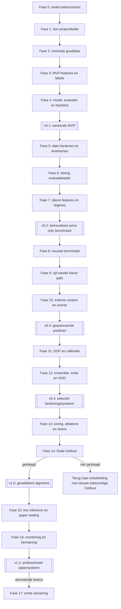

# Roadmap — MVP-first goudprijs-voorspellingssysteem

> Van een kleine, volledig werkende verticale keten naar een professioneel gevalideerd en beheerd voorspellingssysteem.

Deze roadmap operationaliseert het ontwerp uit [project_idea.md](./project_idea.md). Dat document beschrijft de beoogde architectuur; deze roadmap bepaalt de implementatievolgorde.

Het centrale uitgangspunt is bewust MVP-first: we bouwen niet eerst maandenlang losse data-, feature- en modelcomponenten. We maken zo vroeg mogelijk één eenvoudige maar volledige keten:

```text
historische data
-> validatie
-> features
-> labels
-> training
-> voorspelling
-> evaluatie
-> eenvoudige backtest
```

Daarna vervangen of versterken we telkens één onderdeel. Na iedere fase blijft er een uitvoerbare versie bestaan.

---

## Status

| Onderdeel | Huidige status |
|---|---|
| Systeemontwerp | Afgerond in `project_idea.md` |
| Roadmap | Fasen 0–7 geverifieerd; fase 8 is de eerstvolgende ontwikkelfase |
| Implementatie | `v0.2` researchbenchmark met geharde data, fase-6 evaluatiekader en geverifieerde fase-7 featureselectie |
| Huidige release | `v0.2.0` — betrouwbare price-only researchbenchmark |
| Eerstvolgende stap | Fase 8: compact multi-timeframe neuraal kernmodel |
| Standaard einddoel | Professioneel paper-trading-systeem |
| Echte orders | Afzonderlijke, optionele laatste fase |

Een fase wordt pas afgevinkt wanneer haar verificatie en exitcriteria aantoonbaar zijn gehaald.

Taakstatus:

- [ ] nog niet gestart
- [x] voltooid

Inspanningsindicatie:

| Label | Betekenis |
|---|---|
| S | Kleine, afgebakende stap |
| M | Meerdere samenhangende modules en tests |
| L | Groot werkpakket met data- of modelafhankelijkheden |
| XL | Systeemfase met langdurige evaluatie of observatie |

Dit zijn relatieve indicaties, geen kalenderbeloftes.

---

## MVP-first ontwikkelstrategie

### 1. Eerst een verticale doorsnede

De eerste release bevat van elk noodzakelijk onderdeel precies genoeg om de volledige flow te bewijzen. De MVP gebruikt dus nog geen groot neuraal netwerk, externe macrodata, ensemble of live brokerkoppeling.

### 2. Geen wegwerp-MVP

De MVP gebruikt meteen dezelfde basiscontracten die later behouden blijven:

- UTC-timestamps;
- alleen volledig afgesloten candles;
- een expliciete feature-cutoff;
- chronologische datasplits;
- geversioneerde configuratie;
- een reproduceerbare pipeline;
- een vast prediction-outputschema;
- tests tegen datalekken.

De implementatie is klein, maar de fundamentele tijdsregels zijn vanaf dag één correct.

### 3. Iedere uitbreiding is een challenger

De laatst goedgekeurde versie blijft de `champion`. Een nieuwe featuregroep, databron of modelarchitectuur is een `challenger` en wordt alleen gepromoveerd wanneer zij op exact dezelfde ongeziene perioden aantoonbaar beter of minstens robuuster is.

### 4. Complexiteit moet haar plaats verdienen

Een onderdeel wordt niet toegevoegd omdat het theoretisch indrukwekkend is. Het moet:

1. een vooraf gekozen metric verbeteren;
2. die verbetering over meerdere tijdsperioden tonen;
3. calibration en slechtste-foldprestatie niet onaanvaardbaar verslechteren;
4. na kosten bruikbaar blijven;
5. operationeel beheersbaar zijn.

Als XGBoost uiteindelijk beter werkt dan het neurale netwerk, blijft XGBoost de champion.

### 5. Een MVP is geen winstclaim

De vroege MVP bewijst dat de softwareketen en onderzoeksmethode werken. Hij hoeft nog niet winstgevend of professioneel gekalibreerd te zijn. Dat onderscheid voorkomt dat een technisch werkende demo ten onrechte als betrouwbare tradingstrategie wordt beschouwd.

---

## Scope van de eerste MVP

Tenzij fase 0 anders beslist, start release `v0.1` met deze begrensde scope:

| Onderdeel | MVP-keuze |
|---|---|
| Instrument | XAU/USD van één dataleverancier |
| Brongegevens | Volledig afgesloten 1min-candles |
| Afgeleide timeframes | 3min en 15min |
| Primaire predictiehorizon | 15 minuten |
| Target | `down`, `neutral` of `up` |
| Features | Alleen eenvoudige price/candle-features |
| Eerste trainbaar model | Logistische regressie |
| Referenties | Klassefrequentie, laatste richting en eenvoudig momentum |
| Output | Klasse plus `p_down`, `p_neutral` en `p_up` |
| Validatie | Eén vaste chronologische train/validation/test-split |
| Backtest | Eenvoudige long/short/no-signal-simulatie met basiskosten |
| Interface | Reproduceerbare command-lineflow |
| Live orders | Niet inbegrepen |

De eerste historische periode mag klein genoeg zijn om snel te itereren, maar moet groot genoeg zijn om alle seizoenen in de pipeline, verschillende markturen en een echte chronologische test te oefenen. De exacte periode wordt in fase 0 vastgelegd.

### Wat bewust niet in de MVP zit

- extern nieuws of sentiment;
- zilver-, dollar- of rentecontext;
- een neuraal netwerk;
- future-candle-path prediction;
- meerdere modelhorizons;
- een ensemble of meta-labeler;
- automatische hertraining;
- dashboards, cloudinfrastructuur of brokerorders.

Deze onderdelen zijn niet geschrapt. Ze worden pas toegevoegd nadat de end-to-end MVP werkt.

### Definitie van MVP-done

Release `v0.1` is klaar wanneer:

- [x] één commando de volledige lokale pipeline kan uitvoeren;
- [x] dezelfde input en configuratie reproduceerbaar dezelfde dataset en voorspellingen opleveren;
- [x] de pipeline uitsluitend historische informatie gebruikt die op prediction time beschikbaar was;
- [x] een modelartefact wordt opgeslagen en opnieuw geladen kan worden;
- [x] een voorspelling kan worden gemaakt voor een ongeziene, afgesloten candle;
- [x] naïeve baselines en het getrainde model in hetzelfde rapport staan;
- [x] een eenvoudige kostenbewuste backtest draait;
- [x] alle MVP-tests groen zijn;
- [x] het rapport duidelijk zegt dat vroege kansen nog niet als professioneel gekalibreerde zekerheid mogen worden geïnterpreteerd.

Er geldt voor `v0.1` nog geen eis dat het model de markt verslaat. Een negatieve uitkomst is ook nuttig: ze bevestigt dat de meetketen werkt en toont waar verbetering nodig is.

---

## Release-ladder

| Release | Fasen | Werkend resultaat |
|---|---:|---|
| `v0.0` | 0 | Bevroren minimaal onderzoekscontract |
| `v0.1` | 1–4 | End-to-end research-MVP |
| `v0.2` | 5–7 | Betrouwbare multi-timeframe price-only benchmark |
| `v0.3` | 8–10 | Geavanceerd model met neural core, future path en geteste context |
| `v0.4` | 11–12 | Gekalibreerd en selectief beslissingssysteem |
| `v1.0-rc` | 13 | Bevroren kandidaat na tuning en stresstests |
| `v1.0` | 14 | Onafhankelijk gevalideerd research-algoritme |
| `v1.1` | 15–16 | Professioneel beheerd paper-trading-systeem |
| `v2.0` | 17 | Optionele echte uitvoering met externe risicomotor |

Elke release is zelfstandig uitvoerbaar. Een latere fase mag de vorige champion niet onbruikbaar maken.

---

## Volgorde en afhankelijkheden



De kritieke korte route naar een MVP is dus: `0 -> 1 -> 2 -> 3 -> 4`. Alle overige fasen komen daarna.

---

## Promotiepoorten

Iedere fase passeert de poorten die voor haar van toepassing zijn.

### Softwarepoort

- tests zijn groen;
- configuraties en artefacten zijn geversioneerd;
- de vorige release blijft reproduceerbaar;
- foutmeldingen zijn duidelijk;
- een mislukte run schrijft geen stilzwijgend gedeeltelijk resultaat als geldig weg.

### Datapoort

- timestamp-, schema- en kwaliteitscontroles slagen;
- datagaten en stale waarden zijn zichtbaar;
- iedere afgeleide rij is tot bronrecords terug te leiden;
- geen toekomstige observatie lekt naar een eerdere prediction time.

### Modelpoort

- challenger en champion gebruiken identieke splits, labels en kosten;
- verbetering wordt over meerdere tijdsblokken beoordeeld;
- accuracy wordt nooit zonder calibration en coverage geïnterpreteerd;
- de slechtste fold en relevante regimes worden gerapporteerd;
- een complexer model mag ook worden afgewezen.

### Releasepoort

- releaseartefacten zijn bevroren en gehasht;
- beperkingen staan in de model card;
- er is een expliciet `promote`-, `keep champion`- of `stop`-besluit;
- alleen fase 14 mag de finale holdout openen.

---

## Fase 0 — Minimaal onderzoekscontract

**Inspanning:** S  
**Release:** `v0.0`  
**Afhankelijkheden:** geen

### Doel

Net genoeg beslissingen vooraf vastleggen om de MVP correct te bouwen, zonder de start te vertragen met keuzes die pas voor het professionele systeem nodig zijn.

### Implementeren en vastleggen

- [x] Kies het primaire instrument: standaard XAU/USD.
- [x] Kies één historische dataleverancier en noteer diens markturen en timestampbetekenis.
- [x] Controleer of opslag en gebruik van de data zijn toegestaan.
- [x] Gebruik ondubbelzinnige timeframecodes: `1min` is één minuut en `1mo` is één maand.
- [x] Leg prediction time, feature cutoff, entry time en exit time exact vast.
- [x] Kies 15 minuten als eerste primaire horizon of documenteer de afwijking.
- [x] Definieer `up`, `neutral` en `down` met een eerste ruis- en kostenbuffer.
- [x] Leg een eenvoudig MVP-kostenmodel vast.
- [x] Kies chronologische train-, validation- en testperioden voor de MVP.
- [x] Reserveer nu al een latere finale holdout, maar maak die technisch ontoegankelijk voor gewone ontwikkelruns.
- [x] Kies primaire metrics voor richting, probability quality en economische simulatie.
- [x] Schrijf op welke MVP-uitkomst technisch succes betekent.
- [x] Schrijf apart welke eisen pas vanaf `v0.2`, `v1.0` en paper trading gelden.

### Minimale beslissingen

| Vraag | Vereist vóór fase 1 |
|---|---|
| Wat voorspellen we? | Richting over 15 minuten |
| Wanneer wordt voorspeld? | Na sluiting van een volledig afgesloten basiscandle |
| Wanneer zou een trade ingaan? | Eerste uitvoerbare prijs na prediction time |
| Welke data mag het model zien? | Alleen data met `available_at <= prediction_time` |
| Hoe meten we? | Chronologisch, nooit random shufflen |
| Wat is de MVP? | Werkende en eerlijke pipeline, nog geen winstclaim |

### Artefacten

- `docs/research_protocol.md`
- `configs/instrument.yaml`
- `configs/labels.yaml`
- `configs/costs.yaml`
- `configs/splits_mvp.yaml`
- `docs/data_licenses.md`

### Verificatie

- [x] Een voorbeeldtimestamp kan van feature cutoff tot label handmatig worden nagerekend.
- [x] Er bestaat geen ambiguïteit tussen minuut en maand.
- [x] De testperiode ligt volledig na train en validation.
- [x] De finale holdout komt niet voor in normale ontwikkelconfiguraties.
- [x] Geen criterium verwijst naar resultaten die nog niet bekend kunnen zijn.

### Exitcriteria

- Het minimale contract is ingevuld en bevroren.
- Open vragen die de MVP niet blokkeren staan in een latere backlog.
- Fase 1 kan starten zonder model- of datadefinities te raden.

---

## Fase 1 — Dun en uitbreidbaar projectskelet

**Inspanning:** S–M  
**Release:** onderdeel van `v0.1`  
**Afhankelijkheden:** fase 0

### Doel

Een zo klein mogelijke Python-basis maken waarop de volledige MVP kan draaien en die later zonder herschrijven kan worden uitgebreid.

### Technologiestart

- Python voor data-engineering, klassieke ML, PyTorch en backtesting.
- Parquet voor kolomgeoriënteerde datasets.
- YAML voor leesbare experimentconfiguratie.
- pytest voor tests.
- Een eenvoudige lokale run registry voor de MVP; een uitgebreider experimentregister mag later.

### Implementeren

- [x] Initialiseer versiebeheer.
- [x] Maak een `src`-gebaseerd Python-package.
- [x] Leg één ondersteunde Python-versie en een dependency-lockfile vast.
- [x] Voeg centrale configvalidatie toe.
- [x] Voeg UTC-logging en run-ID's toe.
- [x] Configureer reproduceerbare random seeds.
- [x] Maak een veilige `.env.example` zonder geheimen.
- [x] Voeg minimale unit- en integratietestconfiguratie toe.
- [x] Maak directories voor raw, curated, features, models en reports.
- [x] Voeg een command-line entrypoint toe.
- [x] Laat iedere run config, codeversie, dataversie en outputpad registreren.

### Eerste CLI-contract

```text
gold-forecast data import
gold-forecast data validate
gold-forecast dataset build
gold-forecast train
gold-forecast evaluate
gold-forecast backtest
gold-forecast predict
gold-forecast mvp run
```

`gold-forecast mvp run` wordt de eerste verticale smoketest. De subcommando's blijven later bruikbaar.

### Bewust uitgesteld

- Docker- of cloudorchestratie;
- uitgebreide dashboards;
- automatische scheduling;
- distributed training;
- een volledige feature store;
- brokerintegratie.

### Artefacten

- `pyproject.toml`
- dependency-lockfile
- `src/gold_forecasting/`
- `tests/`
- `configs/`
- `data/` met gedocumenteerde lagen
- `models/`
- `reports/`

### Verificatie

- [x] Een schone installatie kan package en CLI laden.
- [x] Een minimale voorbeeldconfig wordt gevalideerd.
- [x] Een ongeldige config faalt met een duidelijke melding.
- [x] Tests draaien via één commando.
- [x] Een lege MVP-smokeflow doorloopt alle geplande stappen met dummydata.

### Exitcriteria

- De package importeert en de CLI werkt.
- De lege end-to-end route is zichtbaar.
- Er is nog geen onnodige infrastructuur gebouwd.

---

## Fase 2 — Minimale gouddata voor de MVP

**Inspanning:** M  
**Release:** onderdeel van `v0.1`  
**Afhankelijkheden:** fase 1

### Doel

Zo snel mogelijk één betrouwbare historische XAU/USD-dataset door de pipeline krijgen.

### Implementeren

- [x] Maak één provideradapter of een strikt importcontract voor een geleverd bestand.
- [x] Download of importeer alleen de in fase 0 gekozen MVP-periode.
- [x] Bewaar originele records immutable in `data/raw`.
- [x] Normaliseer timestamps naar UTC.
- [x] Bewaar alleen afgesloten candles als modelinput.
- [x] Vereis minimaal `open`, `high`, `low`, `close` en waar beschikbaar volume/tick count.
- [x] Controleer unieke sleutels en verwijder duplicaten via een expliciet beleid.
- [x] Valideer OHLC-relaties.
- [x] Detecteer en rapporteer tijdsgaten.
- [x] Maak 3min- en 15min-candles uit 1min-data.
- [x] Gebruik voor hogere candles uitsluitend volledig afgesloten subcandles.
- [x] Schrijf een manifest met bron, periode, parameters, rijaantallen en bestandshashes.
- [x] Maak een klein visueel of tabelrapport van dekking en fouten.

### MVP-datacontract

Minimale sleutel:

```text
instrument + timeframe + timestamp_open_utc + source
```

Minimale metadata:

```text
timestamp_close_utc
is_complete
ingested_at_utc
source
dataset_version
```

### Verificatie

- [x] `high >= max(open, close)`.
- [x] `low <= min(open, close)`.
- [x] `high >= low`.
- [x] Timestamps zijn strikt stijgend per instrument en timeframe.
- [x] Dezelfde import tweemaal creëert geen duplicaten.
- [x] Vijf correct uitgelijnde 3min-candles vormen exact één 15min-candle.
- [x] Een onvolledig venster produceert geen volledige hogere candle.
- [x] Een handmatig gekozen dag komt overeen met de bron.

### Artefacten

- eerste raw dataset;
- eerste curated 1min-, 3min- en 15min-datasets;
- datamanifest;
- dekkings- en gatenrapport;
- provider- of importtests.

### Exitcriteria

- Eén commando bouwt de MVP-data opnieuw op.
- De dataset is chronologisch correct en reproduceerbaar.
- Bekende gaten zijn zichtbaar en niet stilzwijgend geïnterpoleerd.

---

## Fase 3 — MVP-features, labels en datasplits

**Inspanning:** M  
**Release:** onderdeel van `v0.1`  
**Afhankelijkheden:** fase 2

### Doel

Van de minimale candles een eenvoudige, leakage-vrije tabel maken waarop een eerste model eerlijk kan leren.

### Features

- [x] Log-return van de laatste candle.
- [x] Enkele returnlags.
- [x] Candle body en totale range.
- [x] Upper en lower wick.
- [x] Positie van close binnen de candle.
- [x] Kort en middellang momentum.
- [x] Rolling realized volatility.
- [x] Afstand tot één of twee rolling gemiddelden.
- [x] Uur van de dag en weekdag als cyclische variabelen.
- [x] Tick-countverandering bewust niet gebruikt omdat de bron die niet betrouwbaar levert.

Alle rolling features:

- gebruiken alleen afgesloten historische candles;
- worden eerst geshift waar de formule dit vereist;
- bewaren hun lookback en `available_at` in een featurecatalogus.

### Labels

- [x] Bereken de 15min future return vanaf een uitvoerbare entry na prediction time.
- [x] Maak `down`, `neutral` en `up` met de fase-0-buffer.
- [x] Bewaar de continue future return naast de klasse.
- [x] Bewaar prediction time, entry time en label end time.
- [x] Verwijder samples zonder volledige toekomstige labelperiode.

### Splits en preprocessing

- [x] Maak één vaste chronologische train/validation/test-split.
- [x] Voeg minstens de langste labelhorizon als gap toe rond grenzen.
- [x] Fit scalers en imputatie uitsluitend op train.
- [x] Hergebruik dezelfde parameters ongewijzigd op validation en test.
- [x] Bewaar een sample-index met data- en featureversie.
- [x] Gebruik geen random train/test-split.

### Verificatie

- [x] Het veranderen van toekomstige raw data verandert geen oudere feature.
- [x] Voor ieder sample geldt `feature_available_at <= prediction_time`.
- [x] Voor ieder label geldt `entry_time > prediction_time` en `label_end > entry_time`.
- [x] Train-, validation- en testlabels overlappen niet over een grens.
- [x] Scalers hebben nooit validation- of testdata gezien.
- [x] Een willekeurig sample kan handmatig naar raw candles worden herleid.

### Artefacten

- MVP-featurepipeline;
- featurecatalogus;
- MVP-labelpipeline;
- sample-index;
- train-only preprocessors;
- leakage-tests;
- geversioneerde modeltabel.

### Exitcriteria

- De modeltabel kan volledig uit curated data worden herbouwd.
- Alle temporele invarianttests zijn groen.
- Fase 4 kan trainen zonder handmatige data-aanpassingen.

---

## Fase 4 — End-to-end model, voorspelling en backtest

**Inspanning:** M  
**Release:** `v0.1 — research-MVP`  
**Afhankelijkheden:** fase 3

### Doel

De eerste complete versie opleveren die data omzet in een opgeslagen model, een echte out-of-samplevoorspelling en een controleerbaar evaluatierapport.

### Baselines

- [x] Meest voorkomende klasse.
- [x] Altijd `up` en altijd `down`.
- [x] Richting van de laatste candle.
- [x] Eenvoudig momentum.
- [x] Eenvoudige mean reversion.

### Eerste trainbare model

- [x] Implementeer multinomiale logistische regressie.
- [x] Gebruik class weights alleen indien validation dit verantwoordt.
- [x] Selecteer beperkte hyperparameters uitsluitend op validation.
- [x] Fit het uiteindelijke MVP-model volgens het protocol.
- [x] Sla model, preprocessor, featureschema en config samen op.
- [x] Test laden en opnieuw voorspellen.

### Evaluatie v0

- [x] Accuracy en balanced accuracy.
- [x] Macro-F1 en confusion matrix.
- [x] Log loss en Brier score.
- [x] Kansbucket- of reliabilitytabel als diagnostiek.
- [x] Resultaten per sessie-uur.
- [x] Vergelijk alle modellen op exact dezelfde testrecords.

De kansen worden al uitgegeven, maar heten in `v0.1` expliciet voorlopige model probabilities. Professionele kanskalibratie volgt in fase 11.

### Backtester v0

- [x] Scheid prediction time en execution time.
- [x] Ondersteun long, short en geen signaal.
- [x] Neem de in fase 0 vastgelegde basiskosten mee.
- [x] Rapporteer bruto en nettoresultaat.
- [x] Rapporteer aantal signalen, hit rate, gemiddelde trade, drawdown en turnover.
- [x] Maak confidence-thresholds configureerbaar, maar tune ze niet op test.

### Prediction-contract

Een voorspelling bevat minimaal:

```json
{
  "prediction_time_utc": "...",
  "instrument": "XAU_USD",
  "horizon_minutes": 15,
  "predicted_class": "up",
  "p_down": 0.18,
  "p_neutral": 0.27,
  "p_up": 0.55,
  "model_version": "v0.1.0",
  "data_version": "...",
  "calibration_status": "preliminary"
}
```

### Eén-commando-demo

```text
gold-forecast mvp run --config configs/mvp.yaml
```

Dit commando:

1. valideert of hergebruikt de MVP-data;
2. bouwt features en labels;
3. traint baselines en logistische regressie;
4. evalueert op de chronologische test;
5. voert de eenvoudige backtest uit;
6. bewaart model en rapport;
7. toont één voorbeeldvoorspelling.

### Verificatie

- [x] Twee runs met dezelfde data, config en seed leveren dezelfde kernresultaten.
- [x] Een opgeslagen model geeft na herladen dezelfde probabilities.
- [x] Een kapotte of onvolledige candle wordt geweigerd.
- [x] De testset beïnvloedt training en modelselectie niet.
- [x] Backtestposities kunnen niet vóór prediction time openen.
- [x] Alle baselines en het model staan in één vergelijkbaar rapport.

### Exitcriteria en MVP-demo

- De volledige flow draait zonder handmatige tussenstappen.
- De uitkomst is reproduceerbaar en auditbaar.
- De software werkt ook wanneer de logistische regressie nog geen voorspellend voordeel toont.
- Beperkingen en bekende problemen zijn gedocumenteerd.
- Release `v0.1.0` wordt getagd en blijft vanaf nu als fallback uitvoerbaar.

Vanaf dit punt bestaat er een echte MVP. Verdere fasen versterken hem; ze zijn geen voorwaarde meer om iets werkends te kunnen demonstreren.

---

## Fase 5 — Primaire data hardenen en alle timeframes toevoegen

**Inspanning:** L  
**Release:** onderdeel van `v0.2`  
**Afhankelijkheden:** werkende `v0.1`

### Doel

De beperkte MVP-dataset omzetten in een duurzame historische en incrementeel bijwerkbare databasis.

### Implementeren

- [x] Generaliseer het providercontract zonder de eerste adapter te breken.
- [x] Download de volledige gekozen ontwikkelingshistoriek (2020–2024; geen holdout).
- [x] Ondersteun paginering, retries, rate limits en hervatten; HistData hervat op jaararchiefniveau.
- [x] Sla beschikbare bid-OHLC op; ontbrekende ask/mid/spread/tick count expliciet in capabilities.
- [x] Bewaar providerrevisies als contenthash en behoud de oorspronkelijke ingestietijd.
- [x] Maak raw data immutable en bestanden gehasht.
- [x] Implementeer een idempotente incrementele updater.
- [x] Leg kalenderbeleid vast: ongedocumenteerde sluitingen blijven onbekend; expliciete kalendercontracten beschikbaar.
- [x] Markeer missing, stale en incomplete intervallen.
- [x] Voeg datakwaliteit per dag, bron en timeframe toe, inclusief lege datasets.
- [x] Resample vanuit de laagste betrouwbare resolutie.
- [x] Voeg `5min`, `30min`, `1h`, `3h`, `1d` en `1mo` toe; dag/maand blijven voorlopig lege datasets.
- [x] Gebruik voor `1mo` uitsluitend een volledig afgesloten, aantoonbaar volledig kalendermaandvenster.
- [x] Versieer raw, curated, resamplinglogica en kwaliteitsrapportage afzonderlijk.

### Belangrijke invarianten

- De eerste open, hoogste high, laagste low en laatste close bepalen de geaggregeerde candle.
- Hogere candles zien nooit een onvoltooide lagere candle.
- Timeframegrenzen volgen één gedocumenteerde UTC-grid.
- Vijf 3min-candles vormen alleen een 15min-candle wanneer ze exact hetzelfde venster afdekken.
- Ontbrekende marktprijzen worden niet stilzwijgend geïnterpoleerd.
- Rebuild uit dezelfde raw data levert dezelfde curated hashes.

### Artefacten

- productierijpe ingestionmodule;
- volledige raw dataset en manifests;
- curated multi-timeframe datasets;
- incrementele updater;
- datakwaliteitsdashboard of -rapport;
- resampling golden tests.

### Exitcriteria

- Alle gebruikte timeframes zijn reproduceerbaar.
- Bekende gaps zijn verklaard of gemarkeerd.
- De `v0.1`-pipeline kan op de geharde data draaien zonder contractwijziging.

### Verificatie en besluit — 2026-09-05

Zie [het fase-5-verificatierapport](reports/phase5_verification.md) en
[het datacontract](docs/data_contract_phase5.md). Twee herbouws leveren dezelfde 45 curated
Parquet-bestanden en kwaliteitsrapporten op; de volledige MVP geeft op de geharde data
dezelfde modelmetrics en backtest als op de oorspronkelijke data.

Besluit: accepteer de datalaag en behoud de huidige modelchampion. De publieke HistData-bron
blijft bruikbaar voor de gekozen intraday-input. `1d` en `1mo` worden ondersteund maar niet
als modelinput ingezet: zonder vertrouwde kalender is volledigheid niet bewezen. Een
kalender-/feedverbetering is daarvoor nodig; ontbrekende prijzen worden niet ingevuld.
De release blijft `v0.1.0`; fase 6 is als researchbenchmark afgerond en fase 7 is nog
nodig voor de betrouwbare price-only benchmark van `v0.2`.

---

## Fase 6 — Streng evaluatiekader en backtester v1

**Inspanning:** L  
**Release:** onderdeel van `v0.2`  
**Afhankelijkheden:** fase 5

### Doel

Van één MVP-split overstappen naar een onderzoeksopzet die robuust genoeg is om modelkeuzes te beoordelen.

### Labels en horizons

- [x] Maak labels voor 3, 6, 9, 12, 15 en 30 minuten.
- [x] Voeg 1h en 3h toe; stel 24h uit zolang de data geen betrouwbare kalender ondersteunt.
- [x] Gebruik uitvoerbare entryprijzen en cost-aware neutral zones.
- [x] Bewaar continue returns, richting, future range en volatility.
- [x] Versieer iedere labeldefinitie.

### Tijdsvalidatie

- [x] Bouw outer walk-forward-folds.
- [x] Bouw inner folds voor tuning en reproduceerbare inner voorspellingen; volledige OOF-output blijft fase 11.
- [x] Purge samples waarvan labels over een splitgrens lopen.
- [x] Voeg een embargo/gap toe op basis van de langste gebruikte horizon.
- [x] Reserveer een afzonderlijk calibrationblok.
- [x] Vergrendel de finale holdout voor gewone train- en evaluate-commando's.
- [x] Rapporteer zowel foldgemiddelde, mediaan als slechtste fold.

### Sterkere baselines

- [x] Behoud alle MVP-baselines.
- [x] Voeg lineaire returnregressie toe.
- [x] Voeg XGBoost met early stopping toe.
- [x] Maak een eenvoudige volatilitybaseline.
- [x] Registreer per horizon de huidige champion.

### Backtester v1

- [x] Scheid prediction, signal, order en fill time.
- [x] Gebruik ask bij aankoop en bid bij verkoop waar data beschikbaar is.
- [x] Modelleer spread, commissie, latency en configureerbare slippage.
- [x] Verbied overlappende posities wanneer de gekozen policy dat vereist.
- [x] Ondersteun no-signal en confidence/expected-edge thresholds.
- [x] Rapporteer nettoresultaat, drawdown, turnover, exposure en aantal trades.
- [x] Splits resultaten per sessie, horizon en tijdsfold.
- [x] Voorkom thresholdselectie op de evaluatiefold.

### Metricshiërarchie

1. datakwaliteit en coverage;
2. directionele skill;
3. log loss, Brier score en calibration;
4. return/range-fouten;
5. nettoresultaat na kosten;
6. stabiliteit over perioden.

Geen enkele metric volstaat op zichzelf.

### Exitcriteria

- [x] Walk-forwardevaluatie is reproduceerbaar.
- [x] Alle kandidaten gebruiken exact dezelfde records en kosten.
- [x] De finale holdout is nog nooit bekeken.
- [x] Er bestaat een geloofwaardige price-only benchmark waartegen latere complexiteit wordt gemeten.

### Verificatie en besluit — 2026-09-07

De volledige fase-6-run `20260906T180106245286Z-630162b9` is geslaagd: acht horizons,
drie outer jaren, 264 outer evaluaties en 96 getrainde outer fits. De exacte finale
voorspellingen en beleidsselecties zijn opnieuw geproduceerd: 96/96 parity, 2.319
artefacten gecontroleerd, finale holdout niet geopend en de oorspronkelijke run niet
gewijzigd. De selectiecontrole bevestigt dat de rankings en XGBoost-rounds uit de
opgeslagen inner scores overeenkomen; alle 96 geselecteerde policies zijn cash.

Het promotiebesluit is daarom `keep_champion`: geen challenger en geen tradingchampion
wordt geactiveerd. Dit is een gecontroleerd negatief researchresultaat, geen
winstprognose. Zie het [fase-6-verificatierapport](docs/phase6_verification.md), de
[model card](docs/model_card_phase6.md), het
[reproductierapport](reports/phase6_reproduction_20260906T180106245286Z-630162b9.json),
de [selectiecontrole](reports/phase6_selection_verification.json) en de
[MVP-preservatiecontrole](reports/phase6_mvp_preservation.json).

---

## Fase 7 — Rijkere price-only features en regimes

**Inspanning:** L  
**Release:** `v0.2 — betrouwbare price-only benchmark`  
**Afhankelijkheden:** fase 6

### Doel

Meer bruikbare marktstructuur toevoegen zonder meteen externe bronnen of een zwaar model nodig te hebben.

### Featuregroepen

#### Prijs en candles

- [x] Returns en lags per timeframe.
- [x] Body, range, wicks en closepositie.
- [x] Momentum over meerdere lookbacks.
- [x] Afstand tot rolling gemiddelden.
- [x] Rolling realized volatility.
- [x] Breakout- en mean-reversioncontext.

#### Lichte microstructure

> **Geblokkeerd in phase7-v2:** de huidige HistData-bron is bid-only en levert geen betrouwbare historische ask, spread of tick count. Deze waarden worden niet gesynthetiseerd; ze vereisen een nieuwe databron/challenger.

- [ ] Absolute spread en spread in basispunten.
- [ ] Historische spread-z-score.
- [ ] Bid-, ask- en mid-returns.
- [ ] Tick count versus recent gemiddelde.
- [ ] Range per tick.
- [ ] Korte activiteits- en volatiliteitsversnelling.
- [ ] Quote-stalenessindicator.

#### Tijd en sessie

- [x] Aziatische, Europese en Amerikaanse sessie.
- [x] Sessiesoverlap.
- [x] Uur-, weekdag- en maandcontext.
- [ ] Tijd sinds marktopening en tot marktsluiting waar relevant.

#### Eenvoudige regimes

- [x] Volatility bucket.
- [x] Trend score.
- [ ] Spread/liquidity bucket.
- [x] Overlap-aware sessiecontext via one-hot sessievelden.
- [x] Recente shockindicator.

### Multi-timeframe regels

- Een prediction timestamp krijgt alleen de laatst volledig afgesloten candle van elk timeframe.
- Lange timeframes worden niet teruggevuld met informatie uit hun nog open candle.
- Korte heads krijgen vooral prijs, spread en activiteit.
- Middellange en lange heads krijgen geleidelijk meer trend- en regimecontext.
- Batch- en online featureberekening delen dezelfde code.

### Incrementele toelating

Voeg groepen in deze volgorde toe:

1. uitgebreidere price/candle-features;
2. sessiefeatures;
3. lichte microstructure;
4. eenvoudige regimes;
5. extra timeframes.

Na iedere stap:

- train dezelfde baselines opnieuw;
- voer een ablation uit;
- meet snelheid, ontbrekende waarden en stabiliteit;
- behoud de groep alleen als ze waarde of aantoonbare robuustheid toevoegt.

### Verificatie

- [x] Future-data mutation tests voor de volledige catalogus en hogere-timeframe alignment.
- [x] Batch/online-pariteit voor dezelfde timestamp.
- [x] Rolling formules worden op kleine voorbeelden handmatig getest.
- [x] NaN/non-finite waarden en coverage worden gerapporteerd; fold-distributies tonen extremen.
- [x] Scalers fitten uitsluitend op train via de ongewijzigde fase-6 evaluate_fold/modelpipeline.
- [x] Featuredistributies worden per fold vergeleken en als artefact opgeslagen.

### Implementatiestatus — phase7-v2

`phase7-v2` vervangt de onvoltooide v1-prebenchmark. De wijziging houdt dezelfde
MVP-geankerde timestamps voor alle ablations aan en behandelt sparse rijkere features
via train-only mediaanimputatie; v1 leverde geen voltooide benchmarkbeslissing op.

De featurebuilder, gemeenschappelijke ablation-universe, CLI, auditcatalogus,
distributierapportage en leakage/parity-tests zijn geïmplementeerd.

### Verificatie en besluit — 2026-09-07

De formele `phase7-v2`-run `20260907T014255645674Z-b2afe281` is geslaagd op commit
`3f0a703568224fe9169b1e9f8d61dad131f0005b`. De run duurde 7u49m20s; de daaropvolgende
validator controleerde 11.311 artifacts. De finale holdout bleef gesloten.

De feature-isolerende vaste-referencecontrole kiest op alle acht horizons dezelfde
featurevariant als de pipeline researchchampion: full multi-timeframe op 3/9/12/30m,
3min+session+regime op 6m, MVP op 15m en uitgebreid 3min op 60/180m. Het sterkste
consistente bewijs zit op 3m, 30m en 60m, waar macro-F1 in alle drie outer jaren stijgt.
Op 6/9/12/180m worden de formele gates gehaald maar zijn de delta's klein en gemengd.

Er zijn **0 economic promotion candidates**; alle getrainde model-families selecteren
cash/no-trade. `v0.2.0` is daarom een bevroren betrouwbare researchbenchmark, geen
paper- of live-tradingchampion. Zie
[phase7_verification.md](docs/phase7_verification.md) en
[model_card_v0.2.md](docs/model_card_v0.2.md).

### Exitcriteria

- [x] Iedere feature heeft formule, timeframe, lookback en availability time.
- [x] Geen feature gebruikt toekomstige data.
- [x] `v0.2` verslaat of verstevigt `v0.1` op meerdere folds, of blijft bewust eenvoudiger wanneer extra features niets toevoegen.
- [x] De beste price-only researchchampion is per horizon bevroren als fallback voor alle volgende fasen.

---

## Fase 8 — Compact multi-timeframe neuraal kernmodel

**Inspanning:** L  
**Release:** onderdeel van `v0.3`  
**Afhankelijkheden:** fase 7

### Doel

Een compact neuraal netwerk toevoegen dat tijdsreekspatronen en interacties tussen timeframes kan leren, zonder de betrouwbare klassieke modellen te vervangen voordat het zijn nut bewijst.

### Architectuur

- [ ] Maak een afzonderlijke sequence encoder per geselecteerd timeframe.
- [ ] Start met een compacte TCN of GRU; vergelijk pas later met een kleine Transformer.
- [ ] Fuseer timeframe-embeddings met een eenvoudige gated/attention-fusionlaag.
- [ ] Voeg direction heads per horizon toe.
- [ ] Voeg directe return- of quantile-heads toe.
- [ ] Voeg volatility/range-heads toe als hulpdoelen.
- [ ] Laat horizonheads alleen relevante featuregroepen ontvangen.
- [ ] Houd modelgrootte en parameterbudget expliciet begrensd.

### Training

- [ ] Gebruik mini-batches die tijdsvolgorde binnen ieder sample behouden.
- [ ] Gebruik train-only normalisatie.
- [ ] Gebruik class-balanced of focal loss alleen na vergelijking.
- [ ] Gebruik Huber/quantile loss voor continue targets.
- [ ] Normaliseer losscomponenten voordat gewichten worden gecombineerd.
- [ ] Gebruik early stopping op een vooraf gekozen validationmetric.
- [ ] Voeg gradient clipping en NaN-controles toe.
- [ ] Gebruik mixed precision wanneer hardware dit ondersteunt.
- [ ] Registreer config, seed, datahash, curves en checkpoint.
- [ ] Test meerdere seeds voor de beste configuratie.

### Curriculum

1. één 15min direction head;
2. direction plus continue 15min return;
3. meerdere directe horizons;
4. volatility/range als hulpdoel;
5. pas in fase 9 de volledige candle-path.

### Verificatie

- [ ] Overfit bewust een zeer kleine dataset als implementatiesmoketest.
- [ ] Controleer tensorvormen voor ieder timeframe.
- [ ] Controleer gradientnormen.
- [ ] Herhaal dezelfde run met dezelfde seed.
- [ ] Vergelijk exact met logistische regressie en XGBoost.
- [ ] Meet training- en inferencetijd.

### Exitcriteria

- Het model traint stabiel en reproduceerbaar.
- Alle heads produceren structureel geldige outputs.
- Het neural model wordt alleen champion als de verbetering de promotiepoort haalt.
- Anders blijft de price-only XGBoost/logistische champion actief en gaat het netwerk als onderzoeksvariant mee naar fase 9.

---

## Fase 9 — Directe future-candle-path van vijf 3min-candles

**Inspanning:** L  
**Release:** onderdeel van `v0.3`  
**Afhankelijkheden:** fase 8

### Doel

Niet alleen richting voorspellen, maar rechtstreeks een probabilistisch pad voor de volgende vijf 3min-candles leren. De vijf correct uitgelijnde stappen beslaan samen 15 minuten.

### Belangrijk ontwerpbesluit

De champion voorspelt alle vijf toekomstige candles in één forward pass. We voeden een voorspelde candle standaard niet opnieuw als waarheid aan het model. Zo vermijden we dat een kleine fout bij stap één zich recursief door stappen twee tot vijf vermenigvuldigt.

Een recursieve one-stepvariant mag als baseline worden gebouwd, maar niet automatisch als productieontwerp worden aangenomen.

### Targetrepresentatie

- [ ] Voorspel per stap gap ten opzichte van vorige close.
- [ ] Voorspel body.
- [ ] Voorspel upper wick als niet-negatieve waarde.
- [ ] Voorspel lower wick als niet-negatieve waarde.
- [ ] Reconstrueer geldige OHLC-candles.
- [ ] Voeg quantielen of een passende kansverdeling toe.
- [ ] Bewaar de echte vijf-candle-path als label.
- [ ] Voeg rechtstreeks een 15min return/candle-head toe.

### Losses

- [ ] Path loss per stap.
- [ ] Cumulatieve return loss.
- [ ] Direction loss.
- [ ] Range/volatility loss.
- [ ] Temporal consistency loss tussen vijf 3min-candles en de directe 15min-head.
- [ ] Huber of robuuste alternatieven voor uitbijters.
- [ ] Genormaliseerde lossgewichten en gradient clipping.

Meer fouten produceren dus meer leersignaal, maar we maken backpropagation niet “strenger” door onbeperkt grote updates toe te laten. Sneller leren moet voortkomen uit rijkere, goed geschaalde supervision en meerdere samenhangende targets, niet uit instabiele gradients.

### Evaluatie

- [ ] Fout per voorspelde stap.
- [ ] Cumulatieve 15min returnfout.
- [ ] Direction accuracy van het geaggregeerde pad.
- [ ] High/low/range coverage.
- [ ] Quantile coverage en intervalbreedte.
- [ ] Consistency tussen het pad en de directe 15min-head.
- [ ] Vergelijk direct multi-step met recursief one-step.
- [ ] Meet of de path-head de uiteindelijke direction, calibration of nettoresultaten verbetert.

### Promotiebesluit

De path-head blijft in de champion wanneer hij over meerdere folds:

- minstens één primaire metric verbetert;
- calibration niet betekenisvol schaadt;
- niet alleen de gemiddelde maar ook de slechtste fold aanvaardbaar houdt;
- na kosten nuttig blijft;
- stabiel genoeg is voor live inference.

Anders blijft direction/return de champion en wordt future path een optionele onderzoeksoutput.

### Exitcriteria

- Alle gereconstrueerde candles voldoen aan OHLC-invarianten.
- De vijf timestamps en aggregatie naar 15 minuten zijn correct.
- Het nut of gebrek aan nut van future-path learning is eerlijk aangetoond.

---

## Fase 10 — Compacte externe context en eventinformatie

**Inspanning:** L  
**Release:** `v0.3 — geavanceerde predictor`  
**Afhankelijkheden:** fase 9

### Doel

Een kleine set economisch plausibele contextvariabelen toevoegen, één bron tegelijk en volledig point-in-time.

### Toevoegvolgorde

1. zilver;
2. één dollarproxy;
3. één renteproxy;
4. CPI VS;
5. Amerikaanse arbeidsmarktdata;
6. FOMC/rentebesluiten.

### Implementeren

- [ ] Maak een generiek contract voor externe tijdreeksen.
- [ ] Bewaar observatietijd én `available_at`.
- [ ] Voeg `age_seconds`, `is_stale` en `is_missing` toe.
- [ ] Gebruik backward as-of joins.
- [ ] Leg markturen en publicatievertraging per bron vast.
- [ ] Voeg prijs-, momentum- en rolling-correlationfeatures toe.
- [ ] Voeg tijd tot en sinds high-impact events toe.
- [ ] Markeer voor-, tijdens- en na-eventregimes.
- [ ] Gebruik historische consensus/surprise alleen wanneer betrouwbare point-in-time snapshots bestaan.
- [ ] Laat de pipeline ook zonder iedere externe bron werken.

### Strenge toelatingsregel

Na elke bron:

- herbouw dezelfde folds;
- voer een ablation uit;
- meet coverage en stale/missinggedrag;
- vergelijk met de price-only champion;
- verwijder de bron wanneer ze geen consistente waarde toevoegt.

Nieuws-NLP, social sentiment en brede alternatieve datasets blijven uitgesteld. Hun historische point-in-timekwaliteit en revisierisico maken ze geen logische vroege uitbreiding.

### Verificatie

- [ ] Een observatie die na prediction time beschikbaar kwam, wordt nooit gekoppeld.
- [ ] Zomer- en wintertijd rond eventpublicaties zijn getest.
- [ ] Forward-filled waarden worden zichtbaar ouder.
- [ ] Een ontbrekende bron blokkeert of degradeert volgens expliciet beleid.
- [ ] Geen gereviseerde macro-observatie wordt als oorspronkelijke realtimewaarde behandeld.

### Exitcriteria

- Iedere contextwaarde is point-in-time traceerbaar.
- Alleen bewezen nuttige bronnen staan standaard aan.
- `v0.3` blijft zonder context terugvallen op een werkende price-only champion.

---

## Fase 11 — Out-of-foldvoorspellingen en kanskalibratie

**Inspanning:** L  
**Release:** onderdeel van `v0.4`  
**Afhankelijkheden:** fase 10

### Doel

Van ruwe modelscores betrouwbare, op ongeziene data getrainde kansen maken en een veilige basis leggen voor ensemble en meta-labeling.

### OOF-store

- [ ] Train ieder model op een inner trainblok.
- [ ] Voorspel uitsluitend het daaropvolgende ongeziene blok.
- [ ] Herhaal tot ieder toegestaan ontwikkelrecord maximaal één echte OOF-voorspelling heeft.
- [ ] Bewaar model-, data-, feature-, fold- en horizonversie.
- [ ] Bewaar voorspelde kansen, continue outputs en gerealiseerde labels.
- [ ] Bewaar ook regime, eventfase en kostencontext.

Voor ieder OOF-record geldt:

```text
training_end < prediction_time <= oof_block_end
```

### Calibratie

- [ ] Vergelijk temperature scaling en sigmoid/Platt calibration.
- [ ] Gebruik isotonic alleen wanneer er voldoende onafhankelijke data per bucket is.
- [ ] Fit calibrators uitsluitend op OOF/calibrationdata.
- [ ] Maak reliability diagrams.
- [ ] Rapporteer Brier score, log loss en calibration error.
- [ ] Controleer reliability per horizon, regime en eventfase.
- [ ] Versioneer calibrator samen met het model.
- [ ] Definieer gedrag wanneer een probabilitybucket onvoldoende observaties heeft.

### Confidence-contract

Vanaf deze fase mag een percentage als gekalibreerde modelconfidence worden getoond, mits:

- de calibratorversie vermeld is;
- de relevante horizon vermeld is;
- het geen garantie of kans op winst wordt genoemd;
- OOD-status en intervalonzekerheid apart zichtbaar blijven.

### Exitcriteria

- Geen OOF-record is in-sample.
- Gekalibreerde kansen zijn op ongeziene perioden betrouwbaarder dan ruwe scores.
- Kalibratie wordt niet behouden wanneer zij buiten haar fitperiode instabieler maakt.

---

## Fase 12 — Ensemble, meta-labeler, OOD-guard en beslispolicy

**Inspanning:** L–XL  
**Release:** `v0.4 — selectief beslissingssysteem`  
**Afhankelijkheden:** fase 11

### Doel

Niet alleen voorspellen, maar bepalen wanneer het systeem genoeg bewijs heeft om een signaal te geven en wanneer het zich moet onthouden.

### Compact ensemble

- [ ] Combineer eerst gekalibreerde modelkansen met een eenvoudig gemiddelde.
- [ ] Vergelijk daarna beperkte niet-negatieve gewichten die optellen tot één.
- [ ] Leer alle ensembleparameters uitsluitend op OOF-data.
- [ ] Bereken disagreement tussen modelleden.
- [ ] Vergelijk ensemble met ieder afzonderlijk lid.
- [ ] Behoud geen ensemble dat alleen complexiteit toevoegt.

### Meta-labeler

- [ ] Definieer het metatarget volgens het onderzoeksprotocol.
- [ ] Gebruik OOF-kansen, disagreement, regime, spread, intervalbreedte en pathcoherentie.
- [ ] Start met logistische regressie.
- [ ] Test een kleine XGBoost-variant alleen indien nodig.
- [ ] Kalibreer de meta-waarschijnlijkheid afzonderlijk.
- [ ] Laat de meta-labeler een signaal accepteren of weigeren, niet de markt “magisch” opnieuw voorspellen.

### OOD-guard

- [ ] Blokkeer stale essentiële data.
- [ ] Detecteer ruime rolling featurequantielen.
- [ ] Markeer zeldzame regimecombinaties.
- [ ] Gebruik ensemble-disagreement.
- [ ] Gebruik brede predictive intervals.
- [ ] Classificeer input als `in_distribution`, `borderline` of `out_of_distribution`.
- [ ] Log iedere blokkering met reden.

### Decision policy

- [ ] Combineer direction probabilities, verwacht rendement, geschatte kosten, meta-score en OOD-status.
- [ ] Ondersteun long, short en geen signaal.
- [ ] Versioneer thresholds en policy.
- [ ] Tune thresholds uitsluitend binnen ontwikkelingsfolds.
- [ ] Rapporteer accuracy altijd samen met coverage.
- [ ] Rapporteer nettoresultaat altijd samen met aantal beslissingen en exposure.

### Exitcriteria

- Het ensemble evenaart of verslaat stabiel het beste individuele model.
- De meta-labeler voegt waarde toe bij vooraf aanvaardbare coverage.
- OOD- en no-signalbeslissingen zijn volledig auditbaar.
- Als ensemble of meta-labeler faalt, blijft de eenvoudigere gekalibreerde champion actief.

---

## Fase 13 — Begrensde tuning, ablations en stresstests

**Inspanning:** XL  
**Release:** `v1.0-rc`  
**Afhankelijkheden:** fase 12

### Doel

Eén kandidaat voor finale evaluatie kiezen zonder de onaangeraakte holdout te gebruiken.

### Gecontroleerde tuning

- [ ] Leg vooraf een zoekbudget vast.
- [ ] Tune uitsluitend in inner folds.
- [ ] Gebruik early stopping en pruning.
- [ ] Houd pogingen en compute per modelvariant vergelijkbaar.
- [ ] Selecteer niet uitsluitend op accuracy.
- [ ] Bewaar mislukte én geslaagde runs om selection bias zichtbaar te houden.

### Verplichte ablations

- [ ] Alleen MVP-features.
- [ ] Zonder lichte microstructure.
- [ ] Zonder extra timeframes.
- [ ] Zonder regimes.
- [ ] Zonder future-path.
- [ ] Zonder consistency loss.
- [ ] Zonder iedere externe contextbron afzonderlijk.
- [ ] Zonder ensemble.
- [ ] Zonder meta-labeler.
- [ ] Zonder recency weighting.

### Trainingsvensters

- [ ] Expanding window.
- [ ] Rolling window.
- [ ] Recency-weighted expanding window.
- [ ] Vergelijk oude, recente en schokregimes.

### Stresstests

- [ ] Basiskosten.
- [ ] Conservatief verhoogde spread.
- [ ] Hogere slippage in volatiele perioden.
- [ ] Extra inference- en executionlatency.
- [ ] Incidenteel gemiste fill.
- [ ] Ontbrekende of stale externe feed.
- [ ] Tijdelijk ontbrekende eventfeed.
- [ ] Feature-extremen en OOD-input.
- [ ] Meerdere random seeds.
- [ ] Slechtste fold en slechtste belangrijk regime.

### Kandidaatselectie

Een complexere kandidaat wint alleen als zij:

1. primaire metrics over meerdere folds verbetert;
2. probability calibration aanvaardbaar houdt;
3. voldoende coverage behoudt;
4. na conservatieve kosten niet instort;
5. geen onaanvaardbare slechtste-foldprestatie heeft;
6. operationeel uitvoerbaar blijft;
7. een aantoonbare meerwaarde heeft tegenover de eenvoudigste champion.

### Bevriezen

- [ ] Freeze data- en featureschema.
- [ ] Freeze modelweights en calibrators.
- [ ] Freeze ensemble, meta-labeler, OOD en policy.
- [ ] Freeze kosten- en executionconfig.
- [ ] Maak hashes van alle artefacten.
- [ ] Schrijf een model card met beperkingen.
- [ ] Registreer exact één `v1.0-rc`.

### Exitcriteria

- Eén kandidaat is volledig bevroren.
- De finale holdout is nog nooit geopend.
- Alle keuzes kunnen vanuit ontwikkelingsresultaten worden verklaard.

---

## Fase 14 — Eenmalige finale holdout

**Inspanning:** M  
**Release:** `v1.0` bij succes  
**Afhankelijkheden:** fase 13

### Doel

Eenmalig meten hoe het volledig bevroren systeem presteert op een periode die geen enkele ontwerp-, tuning- of thresholdkeuze heeft beïnvloed.

### Uitvoeren

- [ ] Controleer hashes van kandidaat en holdoutmanifest.
- [ ] Maak de holdout uitsluitend voor deze release toegankelijk.
- [ ] Draai exact één primaire evaluatie.
- [ ] Maak direction-, return-, path-, calibration- en coverage-rapporten.
- [ ] Draai dezelfde kostenbewuste backtest.
- [ ] Rapporteer sessies, regimes, events en slechtste deelperiode.
- [ ] Vergelijk uitsluitend met vooraf geregistreerde succescriteria.
- [ ] Neem een expliciet go/no-go-besluit.

### Bij succes

- Tag de kandidaat als `v1.0`.
- Verander geen weights of thresholds vóór de paperfase.
- Publiceer model card, holdoutrapport en bekende beperkingen.
- Start fase 15.

### Bij mislukking

- Geen promotie naar paperchampion.
- Gebruik het resultaat om hypotheses te vormen, niet om dezelfde holdout opnieuw “te halen”.
- Zodra aanpassingen door dit resultaat zijn beïnvloed, wordt de oude holdout ontwikkelingsdata.
- Reserveer een nieuwe toekomstige onaangeraakte holdout voor een volgende finale claim.

### Exitcriteria

- `v1.0` bestaat alleen bij vooraf gedefinieerd succes.
- Een correcte no-go geldt ook als geslaagde onderzoeksdiscipline.

---

## Fase 15 — Live inference en paper trading

**Inspanning:** XL  
**Release:** onderdeel van `v1.1`  
**Afhankelijkheden:** geslaagde fase 14

### Doel

Vooruitkijkende voorspellingen registreren vóór de uitkomst bekend is en papertransacties onder realistische operationele omstandigheden simuleren.

### Live datapipeline

- [ ] Incrementele goud- en toegelaten contextupdates.
- [ ] Alleen volledig afgesloten candles activeren inference.
- [ ] Freshness-, schema-, duplicate- en gatendetectie.
- [ ] Herstartbare en idempotente jobs.
- [ ] Expliciete fallback wanneer een niet-essentiële bron ontbreekt.
- [ ] Fail-closed bij ontbrekende essentiële data.

### Feature- en modelpariteit

- [ ] Gebruik exact dezelfde featurecode en scalers als training.
- [ ] Vergelijk online features periodiek met batchherberekening.
- [ ] Laad uitsluitend bevroren en compatibele artefacten.
- [ ] Blokkeer inference bij schema- of versieconflicten.

### Append-only voorspellingen

- [ ] Sla iedere prediction op vóór het label bekend is.
- [ ] Bewaar model-, data-, feature-, calibrator- en policyversie.
- [ ] Bewaar probabilities, future path, uncertainty, OOD en besluit.
- [ ] Laat achteraf alleen outcomevelden toevoegen.
- [ ] Maak wijzigingen auditbaar; overschrijven is verboden.

### Paper execution

- [ ] Simuleer entry met uitvoerbare bid/ask.
- [ ] Simuleer latency, slippage en kosten.
- [ ] Log order-, fill-, positie- en exitstatus.
- [ ] Voorkom dubbele paperorders na herstart.
- [ ] Bereken equity, drawdown, exposure en turnover.
- [ ] Laat de eenvoudige price-only champion parallel als shadow baseline draaien.

### Observability

- [ ] Data freshness.
- [ ] Pipeline- en inferencelatency.
- [ ] Missing-featurepercentage.
- [ ] OOD-aandeel.
- [ ] Prediction coverage.
- [ ] Calibration na labelrijping.
- [ ] Model-disagreement.
- [ ] Verwachte versus gerealiseerde kosten.
- [ ] Alerts bij mislukte runs en stale data.

### Exitcriteria

- Er zijn voldoende onafhankelijke voorspellingen in de belangrijkste confidencebuckets.
- Meerdere relevante marktregimes zijn geobserveerd.
- Live features komen numeriek overeen met batchfeatures.
- Calibration, coverage en kosten zijn verenigbaar met researchverwachtingen.
- Afwijkingen zijn verklaard vóór fase 16 het systeem automatiseert.

Een vaste observatieduur alleen is onvoldoende; ook het aantal signalen en de diversiteit aan regimes tellen.

---

## Fase 16 — Monitoring, hertraining en professioneel beheer

**Inspanning:** L–XL  
**Release:** `v1.1 — professioneel paper-trading-systeem`  
**Afhankelijkheden:** fase 15

### Doel

Het systeem langdurig betrouwbaar onderhouden zonder na iedere fout impulsief weights te wijzigen.

### Monitoring

- [ ] Feature- en datadrift.
- [ ] Label- en regimedrift.
- [ ] Calibration per horizon.
- [ ] Accuracy-coveragecurve.
- [ ] OOD-aandeel.
- [ ] Ensemble-disagreement.
- [ ] Meta-labeleracceptatie.
- [ ] Kosten-, slippage- en latencydrift.
- [ ] Data- en jobkwaliteit.

### Outcome-finalisatie

- [ ] Koppel gerealiseerde labels pas na volledige horizon.
- [ ] Maak late of gecorrigeerde brondata zichtbaar.
- [ ] Scheid voorlopige van definitieve metrics.
- [ ] Reconcileer dagelijks predictions, labels en paperfills.

### Hertraining

- [ ] Ondersteun expanding, rolling en recency-weighted windows.
- [ ] Bouw nieuwe modellen uitsluitend als challenger.
- [ ] Hergebruik dezelfde walk-forward-, OOF- en calibratieregels.
- [ ] Voer een paper shadow run uit.
- [ ] Promoveer alleen via vastgelegde criteria.
- [ ] Ondersteun onmiddellijke rollback naar vorige champion.
- [ ] Bewaar data-, code-, model- en policylineage.

### Operationele hardening

- [ ] Model registry en release manifests.
- [ ] Health checks en alerts.
- [ ] Back-ups van kritieke artefacten.
- [ ] Hersteltest na proces- of machine-uitval.
- [ ] Runbooks voor stale data, model failure en rollback.
- [ ] Toegangsbeheer voor secrets en releasepromotie.
- [ ] Auditlog van iedere model- en policywijziging.

### Promotieflow

```text
nieuwe afgesloten data
-> gevalideerde outcomes
-> challenger trainen
-> walk-forward evalueren
-> OOF en calibratie
-> stress en ablations
-> paper shadow run
-> promotie of afwijzing
```

### Exitcriteria

- Retraining is reproduceerbaar en gecontroleerd.
- Geen challenger kan automatisch champion worden zonder bewijs.
- Rollback en herstel zijn getest.
- Het systeem kan langdurig als paperdienst worden beheerd.
- `v1.1` voldoet aan de definitie van het professionele standaard-eindproduct.

---

## Fase 17 — Optionele echte uitvoering

**Inspanning:** XL  
**Release:** eventueel `v2.0`  
**Afhankelijkheden:** langdurig stabiele fasen 15–16 en een afzonderlijke expliciete beslissing

### Doel

Alleen indien later gewenst een paperbeslissing gecontroleerd naar een echte brokerorder vertalen.

### Extra vereisten

- [ ] Juridische, fiscale, broker- en datavereisten opnieuw controleren.
- [ ] Broker sandbox gebruiken.
- [ ] Idempotente client order IDs.
- [ ] Robuuste orderstatusmachine.
- [ ] Reconciliatie met echte brokerposities.
- [ ] Bescherming tegen dubbele, vertraagde en gedeeltelijk gevulde orders.
- [ ] Position sizing volledig loskoppelen van de directionele voorspeller.
- [ ] Maximale positie- en exposurelimieten.
- [ ] Dagelijkse loss- en drawdownlimieten.
- [ ] Maximaal aantal orders per periode.
- [ ] Kill switch buiten het model.
- [ ] Handmatige pauze en hervatting.
- [ ] Alerts bij iedere order- of positieafwijking.
- [ ] Start met minimaal toegestane, gecontroleerde blootstelling.
- [ ] Vergelijk echte fills tijdelijk parallel met paperfills.

### Harde regels

- Het model mag nooit risicolimieten wijzigen.
- Hoge confidence omzeilt nooit een limiet of kill switch.
- Een richtingvoorspelling bepaalt niet zelfstandig position size.
- Een technisch probleem resulteert standaard in geen nieuwe order.
- Deze fase vereist expliciete menselijke activatie en valt niet automatisch onder “project voltooid”.

### Exitcriteria

- Sandbox en foutscenario's zijn volledig getest.
- Alle risicolimieten worden buiten het model afgedwongen.
- Reconciliatie en kill switch zijn bewezen.
- Er is afzonderlijke menselijke goedkeuring.

---

## Doorlopende kwaliteitslijnen

Deze werkzaamheden starten zodra ze relevant worden en lopen daarna door.

### Testpiramide

#### Unit tests

- candlevalidatie;
- resampling;
- featureformules;
- labels;
- splitlogica;
- lossfuncties;
- candle-reconstructie;
- calibratie;
- decision policy;
- kostenberekening.

#### Invariant- en propertytests

- geen toekomstige timestamps in features;
- geldige OHLC-candles;
- geordende quantielen;
- geen overlap tussen splits;
- deterministische resampling;
- idempotente ingestie;
- append-only predictions.

#### Integratietests

- provider naar raw;
- raw naar curated;
- curated naar features;
- features naar dataset;
- dataset naar training;
- model naar calibratie en ensemble;
- prediction naar backtest;
- live candle naar opgeslagen prediction;
- prediction naar gerijpt outcome.

#### Golden tests

Een klein, handmatig gecontroleerd tijdsvenster krijgt vaste verwachte outputs voor:

- timeframeaggregatie;
- featureberekening;
- labelconstructie;
- kosten en fills;
- één volledige prediction.

### Reproduceerbaarheid

Iedere belangrijke run bewaart:

- codecommit;
- volledige configsnapshot;
- dataset- en featuremanifest;
- random seed;
- dependencyversies;
- model-, scaler- en calibratorhashes;
- metrics en logs;
- parent/challenger-relatie.

### Documentatie

Na iedere release worden minimaal bijgewerkt:

- architectuur-README;
- configuratiereferentie;
- dataset card;
- featurecatalogus;
- model card;
- experiment- en ablationrapport;
- bekende beperkingen;
- beslissingslog;
- deze roadmap.

---

## Standaard projectstructuur

De exacte structuur mag tijdens implementatie verfijnd worden, maar de lagen blijven gescheiden:

```text
configs/
data/
  raw/
  curated/
  features/
  labels/
  oof_predictions/
docs/
models/
reports/
src/gold_forecasting/
  ingestion/
  validation/
  resampling/
  features/
  datasets/
  models/
  calibration/
  ensemble/
  meta_labeling/
  ood/
  evaluation/
  backtesting/
  inference/
  monitoring/
tests/
```

Training, backtest en live inference mogen geen drie verschillende feature-implementaties krijgen. Ze gebruiken dezelfde broncode met een andere uitvoeringsmodus.

---

## Regels voor incrementele uitbreiding

Bij iedere nieuwe component wordt deze vaste cyclus gevolgd:

1. schrijf hypothese en verwachte verbetering op;
2. voeg de component achter een feature flag toe;
3. schrijf unit-, leakage- en integratietests;
4. genereer resultaten op dezelfde ontwikkelingsfolds;
5. vergelijk met de huidige champion;
6. voer een ablation uit;
7. controleer calibration, coverage, kosten en slechtste fold;
8. promoveer, behoud als experiment of verwijder;
9. update model card en beslissingslog.

Hierdoor groeit het project geleidelijk zonder dat we later niet meer weten welke toevoeging werkelijk hielp.

---

## Stop- en terugvalregels

### Als primaire data onvoldoende is

- Verklein de scope of verander dataleverancier.
- Zonder historische bid/ask kan research op mid-price doorgaan met een conservatieve spreadschatting, maar er volgt geen sterke executionclaim.
- Bij structurele gaten wordt niet stilzwijgend geïmputeerd.

### Als de MVP geen signaal vindt

- Behoud de MVP als correcte meetketen.
- Controleer eerst labelruis, entrytiming, kostenbuffer, datakwaliteit en horizon.
- Bouw niet meteen een groter netwerk om een methodologisch probleem te verbergen.

### Als rijkere features niet helpen

- Behoud het eenvoudiger featureschema.
- Verwijder dure of fragiele groepen.

### Als het neurale model niet wint

- Gebruik logistische regressie of XGBoost als champion.
- Neural blijft alleen als challenger of wordt verwijderd.

### Als future-path learning niet helpt

- Schakel path-loss voor de champion uit.
- Behoud direction/return-heads.
- Gebruik de pathmodule hoogstens als onderzoeksvisualisatie.

### Als externe context niet helpt

- Verwijder de bron.
- De price-only pipeline blijft volledig bruikbaar.

### Als calibration of meta-labeling alleen bij minieme coverage goed lijkt

- Verwerp of vereenvoudig de module.
- Hoge accuracy op vrijwel geen beslissingen is geen bruikbaar systeemresultaat.

### Als de finale holdout faalt

- Geen `v1.0`-promotie.
- De oude holdout wordt na analyse ontwikkelingsdata.
- Voor een nieuwe finale claim is een nieuwe toekomstige holdout vereist.

### Als paperresultaten afwijken

- Controleer eerst data freshness, featurepariteit, latency, spread, slippage, labelrijping en calibratie.
- Hertrain niet automatisch om de afwijking te verbergen.

---

## Expliciet uitgestelde ideeën

Deze zaken kunnen later onderzocht worden, maar staan niet op het kritieke pad:

- brede nieuws- en social-sentimentmodellen;
- orderboekdiepte wanneer geen betrouwbare historische feed bestaat;
- reinforcement learning voor richtingvoorspelling;
- zeer grote Transformers;
- tientallen gecorreleerde externe markten;
- volledig automatische modelpromotie;
- cloud- of distributed infrastructuur vóór lokale noodzaak;
- echte orders vóór langdurige paperobservatie.

Ze worden alleen toegevoegd via dezelfde hypothese-, ablation- en promotiecyclus.

---

## Definitie van “werkend” per volwassenheidsniveau

### Niveau 1 — Research-MVP (`v0.1`)

- Eén reproduceerbare verticale keten.
- Leakage-vrije eenvoudige features en labels.
- Baselines plus één trainbaar model.
- Voorlopige probabilities.
- Chronologische evaluatie en eenvoudige backtest.

### Niveau 2 — Betrouwbare researchbenchmark (`v0.2`)

- Geharde multi-timeframe data.
- Walk-forwardvalidatie en realistischere kosten.
- Sterke klassieke baselines.
- Geteste price-only features en regimes.

### Niveau 3 — Geavanceerde predictor (`v0.3–v0.4`)

- Neural core en future path zijn eerlijk vergeleken.
- Alleen nuttige externe context is behouden.
- Kansen zijn op OOF-data gekalibreerd.
- Ensemble, meta-labeler en OOD ondersteunen selectieve beslissingen.

### Niveau 4 — Gevalideerd research-algoritme (`v1.0`)

- Kandidaat doorstaat ablations en stresstests.
- Alle artefacten zijn bevroren.
- Onafhankelijke finale holdout haalt vooraf bepaalde criteria.

### Niveau 5 — Professioneel paper-trading-systeem (`v1.1`)

- Live data en inference draaien stabiel.
- Voorspellingen zijn append-only opgeslagen vóór outcomes.
- Paperfills gebruiken realistische bid/ask, latency en kosten.
- Monitoring, challengertraining, promotie en rollback werken.

Dit is het standaard eindpunt van het project.

### Niveau 6 — Echte uitvoering (`v2.0`, optioneel)

- Alle eisen van niveau 5 blijven gelden.
- Brokerintegratie en onafhankelijke risicomotor zijn getest.
- Activatie is afzonderlijk en expliciet goedgekeurd.

---

## Eerstvolgende concrete implementatiereeks

De eerste vijf werkblokken zijn bewust volledig op de MVP gericht:

1. **Fase 0:** vul het minimale onderzoekscontract in.
2. **Fase 1:** maak package, config, tests en lege CLI-flow.
3. **Fase 2:** haal één beperkte XAU/USD-periode door raw en curated.
4. **Fase 3:** bouw de eerste leakage-vrije modeltabel.
5. **Fase 4:** train logistische regressie, evalueer, backtest en toon één voorspelling.

Na werkblok 5 wordt `v0.1` gedemonstreerd en bevroren. Pas daarna start fase 5. Zo hebben we vroeg een tastbaar resultaat, terwijl iedere latere stap datzelfde werkende systeem gecontroleerd uitbreidt tot een professioneel algoritme.

---

## Roadmaponderhoud

Na iedere fase:

- vink voltooide taken af;
- noteer de release- en artefacthashes;
- link het verificatierapport;
- noteer promote/keep/stop;
- voeg nieuwe ideeën toe aan de juiste latere fase;
- verander nooit stilzwijgend oude succescriteria;
- maak een nieuwe roadmapversie wanneer de volgorde inhoudelijk wijzigt.

De roadmap is daarmee niet alleen een planning, maar ook het auditspoor van hoe de uiteindelijke champion tot stand kwam.
